# Software Design Document — Infralytix
### Following the IEEE 1016 Software Design Description approach
**Version 1.1** *(updated against the actual SRS v1.0 — see Changelog at the end of this document)*

> **Note on scope:** This SDD is written to be consistent with the SRS v1.0 section references and FR-*/NFR-* identifiers you supplied in Chapter 1. The full SRS text wasn't included in what you uploaded, so where a requirement is referenced by code only (e.g., `FR-SCH-4`, `NFR-PERF-2`), this document infers a reasonable, clearly-labeled design response from context rather than inventing new requirement wording. Please cross-check these against your actual SRS before submission — flag anything that doesn't match and I'll correct it.

---

## Document Roadmap

| Ch. | Content | Status |
|---|---|---|
| 1 | System Design Overview | ✅ Included below |
| 2 | High-Level Design | ✅ Included below |
| 3 | Low-Level Design | ✅ Included below |
| 4 | Component Design | ✅ Included below |
| 5 | Module Design (all 9 modules) | ✅ Included below |
| 6 | Database Design (ER model, DDL) | ✅ Included below |
| 7 | API Design (full REST spec) | ✅ Included below |
| 8 | Frontend Design | ✅ Included below |
| 9 | Scheduler Design (deep dive) | ✅ Included below |
| 10 | Security Design | ✅ Included below |
| 11 | Failure Analysis | ✅ Included below |
| 12 | Deployment Design | ✅ Included below |

**All 12 chapters complete.**

---

# Chapter 1 — System Design Overview

## 1.1 Introduction

This Software Design Document (SDD) translates the requirements defined in the **Infralytix Software Requirements Specification (SRS v1.0)** into an architectural and technical design, following the **IEEE 1016** approach to software design description. It is intended for the development team implementing Infralytix and for reviewers assessing design soundness and traceability to requirements.

This document does not introduce, remove, or reinterpret any requirement stated in the SRS. Every design decision here exists to satisfy a specific Functional Requirement (`FR-*`) or Non-Functional Requirement (`NFR-*`) already approved in that document. Where the SRS is silent, this SDD makes explicit, justified engineering decisions consistent with the Infralytix Developer Playbook.

## 1.2 Purpose of This Document

| Objective | Description |
|---|---|
| **Architectural definition** | Establish the system's layered architecture, component boundaries, and communication pathways. |
| **Design traceability** | Map every module design back to its originating FR/NFR identifiers in the SRS. |
| **Implementation guidance** | Provide sufficient technical detail (data structures, APIs, algorithms, schemas) for direct implementation without further architectural decisions. |
| **Verification basis** | Serve as the reference against which code review, unit tests, and integration tests are conducted. |

## 1.3 Scope of the Design

Consistent with SRS §1.2:

**In design scope:** authentication and session management; DAG-based workflow ingestion, parsing, and validation; VM pool configuration; execution of the Advanced Cost-Aware Max–Min algorithm and three baseline algorithms; a Pricing Engine supplying cost data to the scheduler; persistence of runs and assignments; dashboard and Gantt visualization; PDF/CSV report export; and a forward-looking Recommendation Engine module (documented for extensibility per SRS §7.3, not part of the current release).

**Out of design scope:** provisioning of real cloud infrastructure, live billing-API integration, multi-region deployment, and network-latency/data-transfer modeling — explicitly excluded per SRS §1.2.

## 1.4 Design Goals

| Goal | Driving Requirement(s) | Design Response |
|---|---|---|
| Algorithmic fidelity | `FR-SCH-1`–`FR-SCH-12`, SRS §2.5 | Scheduler Engine implements Algorithm 2 without deviation; baseline algorithms isolated in separate strategy classes. |
| Security by design | `NFR-SEC` (§5.2) | JWT + bcrypt auth, parameterized queries, XXE-disabled XML parsing, upload whitelisting, rate limiting — detailed in Chapter 10. |
| Predictable performance | `NFR-PERF-1`–`4` | O(mn²) scheduler complexity preserved; cached ETC/cost matrices; paginated list endpoints. |
| Usability under live interaction | `NFR-USE-1`, `NFR-USE-2` | α-slider triggers incremental recomputation (Chapter 8); validation errors are field-specific, not generic. |
| Maintainability within scope constraints | `NFR-MAINT-1`, `NFR-MAINT-2` | Single-service-per-component design (not microservices); structured logging at API and scheduler boundaries. |
| Verifiable correctness | `FR-SCH-12`, SRS §7.1 | Design isolates the scheduler as an independently testable unit reproducing the paper's 5.9s worked-example makespan. |

## 1.5 Design Constraints

Carried forward unaltered from SRS §2.5 and §2.6:

1. The Advanced Cost-Aware Max–Min algorithm's task-selection and VM-selection rules **may not be altered** from Algorithm 2 of the source paper.
2. Infralytix is a **simulator only** — no real VM provisioning, no live billing integration.
3. Architecture is **single-service per component** (frontend, backend, scheduler, database) — explicitly **not** a microservice decomposition, even though the scheduler runs as a distinct process/language runtime.
4. **MySQL** is the mandated relational store.
5. Cost is modeled **linearly** (cost per 1000 MI only); tiered/spot pricing is out of scope.
6. The Python scheduler is invoked from Node.js via **process spawn / IPC** ("Scheduler Bridge"), **not** a networked microservice call.

## 1.6 System Context

Infralytix is a self-contained, multi-tenant web application with three external-facing actors and no external system integrations (per SRS §4.3/§4.4 — no hardware interfaces, no third-party billing APIs).

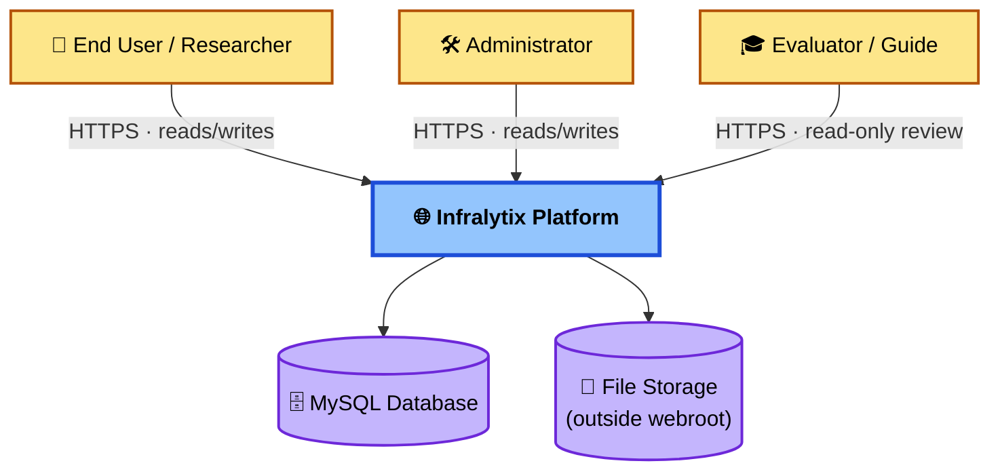

No hardware interfaces exist; all VM characteristics (MIPS, cost) are user-declared simulation parameters, not measurements from physical or provisioned infrastructure.

## 1.7 Architectural Style

The system follows a **layered (n-tier) architecture**, per SRS §6.1:

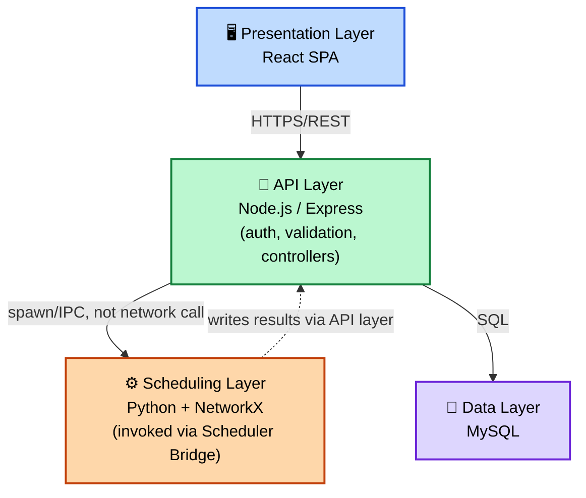

This is deliberately **not** a microservices architecture: the scheduler is a separate runtime/language for algorithmic reasons (Python/NetworkX fidelity to the reference implementation), but it is deployed and versioned as part of a single logical backend service, per SRS §2.5 / `NFR-MAINT-2`.

## 1.8 Module Inventory

The design decomposes the system into nine modules, mirroring the SRS's functional grouping (§3.1–§3.8) plus the forward-looking Recommendation Engine (§7.3):

| # | Module | Primary SRS Section |
|---|---|---|
| 1 | Authentication | §3.1 |
| 2 | Workflow Upload | §3.2 |
| 3 | Workflow Analyzer (DAG Parser) | §3.3 |
| 4 | VM Manager | §3.4 |
| 5 | Scheduler Engine | §3.5, Appendix A |
| 6 | Pricing Engine | §3.6 |
| 7 | Dashboard | §3.7 |
| 8 | Reports | §3.8 |
| 9 | Recommendation Engine (future scope) | §7.3 |

Full module-level design (purpose, responsibilities, workflow, I/O, tables, APIs, validation, failure modes, security, future scope) is provided in Chapter 5.

## 1.9 Design Principles Applied

- **Separation of paper-fidelity vs. engineering extension** — every scheduler design element is labeled either `Source: Research Paper` or `Engineering Extension` so algorithmic correctness can be independently audited (SRS §5.6).
- **Fail-safe defaults** — invalid input (cyclic DAG, missing VM, expired JWT) is rejected before reaching the scheduler, never silently corrected.
- **Statelessness at the API layer** — JWT-based auth avoids server-side session state, supporting horizontal scaling of the Express tier.
- **Single Responsibility per module** — each module in §1.8 owns exactly one bounded concern and one set of database tables, minimizing cross-module coupling.
- **Traceability by identifier** — every design element in this document is traceable to an `FR-*`/`NFR-*` code from the SRS.

## 1.10 Document Organization

| Chapter | Content |
|---|---|
| 2 | High-Level Design (architecture, layers, data/control flow) |
| 3 | Low-Level Design (class/function-level decomposition) |
| 4 | Component Design (component contracts and interactions) |
| 5 | Module Design (all nine modules in full detail) |
| 6 | Database Design (ER model, DDL-level table design) |
| 7 | API Design (complete REST specification) |
| 8 | Frontend Design (pages, components, state) |
| 9 | Scheduler Design (deep dive — algorithm, pseudocode, complexity) |
| 10 | Security Design |
| 11 | Failure Analysis |
| 12 | Deployment Design |

---

# Chapter 2 — High-Level Design

## 2.1 Overview

This chapter expands the layered architecture from §1.7 into concrete data flow, control flow, and cross-cutting design decisions. Every diagram in this chapter is colour-coded by layer, consistent with §1.7:
🔵 **Presentation** · 🟢 **API** · 🟠 **Scheduling** · 🟣 **Data**.

## 2.2 Detailed Layer Responsibilities

| Layer | Owns | Does Not Own |
|---|---|---|
| Presentation | Rendering, client-side validation, optimistic UI state | Business rules, persistence, algorithm logic |
| API | Authentication, request validation, orchestration, persistence calls | DAG scheduling logic itself |
| Scheduling | DAG construction, Algorithm 2 execution, metrics computation (Eq. 1–3) | HTTP concerns, persistence, auth |
| Data | Durable storage, referential integrity, indexing | Business logic |

## 2.3 End-to-End Data Flow — "Run a Schedule"

```mermaid
flowchart LR
    classDef pres fill:#BFDBFE,stroke:#1D4ED8,stroke-width:2px,color:#000
    classDef api fill:#BBF7D0,stroke:#15803D,stroke-width:2px,color:#000
    classDef sched fill:#FED7AA,stroke:#C2410C,stroke-width:2px,color:#000
    classDef data fill:#DDD6FE,stroke:#6D28D9,stroke-width:2px,color:#000

    A["📤 User uploads workflow<br/>+ selects VM pool + α"]:::pres --> B["✅ API validates request<br/>(auth, file type, size)"]:::api
    B --> C["🗂️ Workflow Analyzer<br/>parses file → task list + edges"]:::api
    C --> D["🔀 Scheduler Bridge<br/>spawns Python process,<br/>passes DAG + VM data via stdin/temp file"]:::api
    D --> E["🧩 DAG Builder<br/>NetworkX graph + cycle check"]:::sched
    E --> F["⚡ Advanced Cost-Aware<br/>Max-Min Engine (Algorithm 2)"]:::sched
    F --> G["📊 Metrics Calculator<br/>Eq. 1-3: makespan, utilization, idleness cost"]:::sched
    G --> H["📥 Scheduler Bridge<br/>reads result via stdout/temp file"]:::api
    H --> I[("💾 Persist run + assignments<br/>MySQL")]:::data
    I --> J["📈 Dashboard renders<br/>schedule + Gantt + metrics"]:::pres
```

**Design note:** Step D→H is the **Scheduler Bridge** — per constraint §1.5(6), this is a local process spawn (e.g., Node's `child_process.spawn`) with data exchanged via `stdin`/`stdout` (JSON) or a short-lived temp file, *not* an HTTP call to a separate networked service. This keeps deployment as a single logical backend unit while still isolating the scheduler's Python/NetworkX runtime.

## 2.4 Control Flow — Scheduler Bridge Invocation

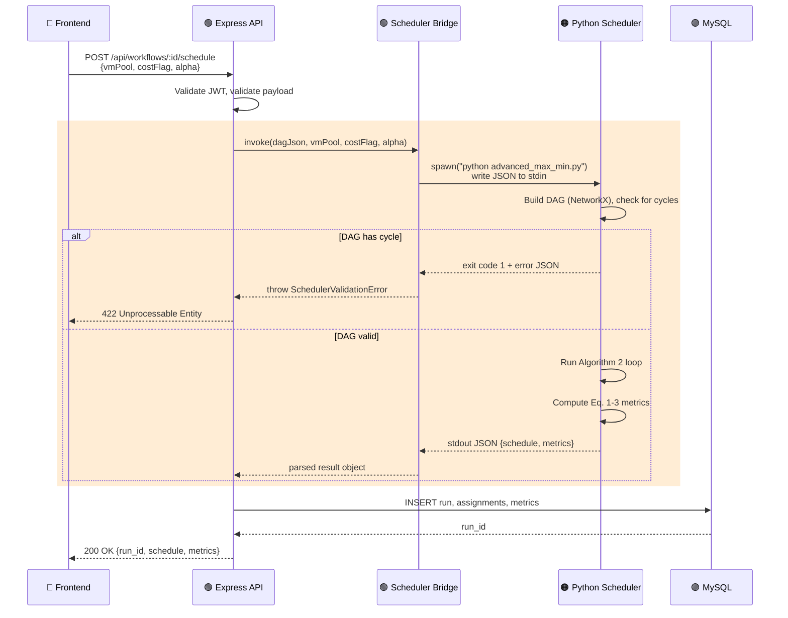

## 2.5 Cross-Cutting Concerns

| Concern | Design Response | Traces To |
|---|---|---|
| **Logging** | Structured JSON logs at API boundary (request in/out) and at Scheduler Bridge boundary (invocation, exit code, duration) | `NFR-MAINT-2` |
| **Error handling** | Centralized Express error-handling middleware; scheduler errors mapped to `422` (invalid input) vs `500` (internal fault) | `NFR-MAINT-1` |
| **Auth** | JWT verified in Express middleware before any controller runs; no route bypasses this except `/login`, `/register` | `NFR-SEC` |
| **Performance caching** | ETC (execution-time) matrix and normalized cost matrix computed once per run and reused across the scheduling loop, not recomputed per task | `NFR-PERF-2` |
| **Pagination** | All list endpoints (`/workflows`, `/runs`, `/reports`) support `limit`/`offset` to bound response size | `NFR-PERF-4` |

## 2.6 Why Not Microservices (Design Rationale)

Per constraint §1.5(3), a networked microservice for the scheduler was considered and rejected for this release:

| Option | Pros | Cons | Decision |
|---|---|---|---|
| Networked scheduler microservice (REST/gRPC) | Independently scalable; language-agnostic contract | Extra deployment complexity, network latency, additional failure mode (service unreachable) for a project scoped as a single-tenant-per-review demo | ❌ Rejected for v1.0 — flagged as a future improvement (see Ch. 12) |
| Scheduler Bridge (spawn/IPC) | Simple single-service deployment; no network hop; matches `NFR-MAINT-2` | Harder to horizontally scale scheduler independently of API tier | ✅ **Selected** |

### Summary
Chapter 2 formalizes the four-layer architecture into concrete data flow (upload → schedule → persist → render) and control flow (the Scheduler Bridge's spawn/IPC contract), and documents *why* a networked microservice was rejected in favor of a single deployable backend unit.

### Key Points
- The Scheduler Bridge is a **local process spawn**, not a network call — this is a hard constraint from the SRS, not a style preference.
- Cycle detection happens **inside** the Python DAG Builder, before Algorithm 2 ever runs — invalid input never reaches the scheduling loop.

### Implementation Checklist
- [ ] Can you trace every arrow in §2.3 back to a specific file/function you plan to write?
- [ ] Does your error-handling design distinguish `422` (bad input) from `500` (internal fault) at the Bridge boundary?

### Review Questions (sample)
1. Why was a networked microservice architecture rejected for the scheduler in this release?
2. Where exactly does cycle detection happen, and why does it matter that it happens *before* Algorithm 2 runs?

### Future Improvements
- Revisit the Scheduler Bridge as a networked service if concurrent multi-user scheduling load becomes a bottleneck (ties to the "Rejected" row in §2.6).

---

---

# Chapter 5 — Module Design

## 5.0 Module Dependency Overview

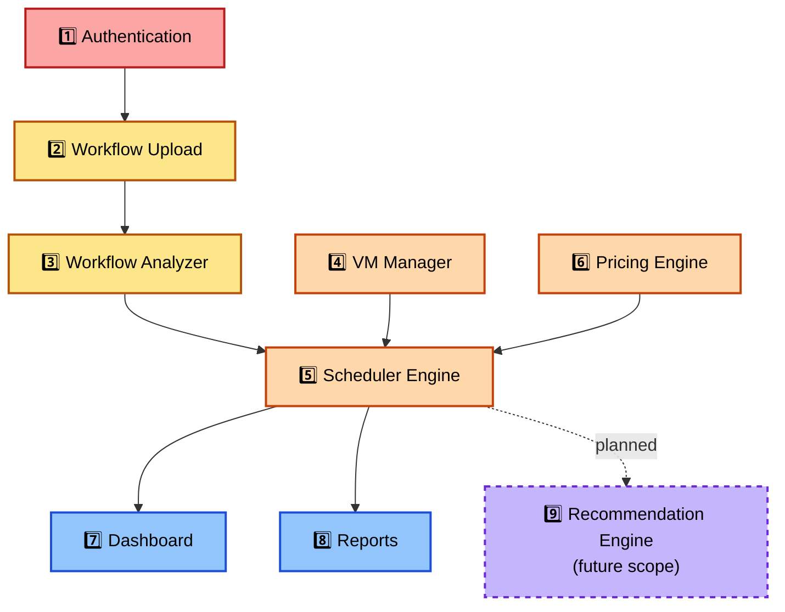

Each module below follows: **Purpose · Responsibilities · Inputs/Outputs · Workflow · APIs · DB Tables · Validation · Dependencies · Advantages · Limitations · Failure Scenarios (brief — full detail in Ch. 11) · Implementation Notes · Guide Questions**.

---

## 5.1 Authentication `[§3.1]`

- **Purpose:** Establish and verify user identity for every protected route.
- **Responsibilities:** Registration, login, JWT issuance/verification, password hashing, role assignment (User/Administrator/Evaluator).
- **Inputs:** email, password (registration/login); JWT (subsequent requests).
- **Outputs:** JWT access token; authenticated `req.user` context for downstream controllers.
- **Workflow:** Register → hash password (bcrypt) → store user → Login → verify hash → issue JWT → client attaches `Authorization: Bearer <token>` on every request → middleware verifies signature + expiry before controller runs.
- **APIs:** `POST /api/auth/register`, `POST /api/auth/login`, `GET /api/auth/me`, `POST /api/auth/refresh` **[Added]** (full spec in Ch. 7).
- **DB Tables:** `users`, `refresh_tokens` **[Added]**.
- **Validation:** Email format, password minimum length/complexity, duplicate-email rejection.
- **Dependencies:** None (foundational module — everything else depends on it).
- **Advantages:** Stateless (JWT) → horizontally scalable API tier (`NFR-MAINT-2`).
- **Limitations:** No built-in token revocation list for *access* tokens in v1.0 — a stolen access token remains valid until expiry; refresh tokens, however, are individually revocable (see below).
- **Failure Scenarios:** Expired JWT → `401`; malformed token → `401`; brute-force login attempts → rate-limited (Ch. 10); refresh token reused after rotation → all tokens in that family revoked, forcing re-login.
- **Implementation Notes:** Store only the bcrypt hash, never the plaintext password, not even transiently in logs.

**[Added] Refresh Token Design (FR-AUTH-3):** Login issues both a short-lived JWT access token and an opaque refresh token. Only a SHA-256 hash of the refresh token is persisted in `refresh_tokens` — never the raw value, mirroring the password-hash discipline used for `users`. `POST /api/auth/refresh` accepts the raw refresh token, looks up its hash, and — if valid and unexpired — issues a new access token and **rotates** the refresh token (old row marked `revoked_at`, a new row inserted). Presenting an already-rotated (revoked) refresh token is treated as a possible theft signal: the entire token family for that user is revoked, forcing a fresh login. This closes the "no revocation" limitation above for the refresh flow specifically, while leaving the access token itself revocation-free by design (consistent with `NFR-MAINT-2`'s stateless-API goal).

**[Added] Role-Based Access (FR-AUTH-7):** The `users.role` column (`user` / `administrator` / `evaluator`) set at registration/admin action is checked by an authorization middleware layered on top of the existing JWT-verification middleware. `evaluator` accounts are restricted to read-only routes (`GET`, no mutating verbs) across all users' workflows, runs, and reports — this is what the Dashboard module (5.7) refers to as "Evaluator role" access.
- **Guide Questions:** *Why JWT over server-side sessions here? What's the tradeoff you accepted by not having a revocation list?*

## 5.2 Workflow Upload `[§3.2]`

- **Purpose:** Accept a workflow definition file from the user and stage it for parsing.
- **Responsibilities:** File-type/size validation, virus-scan hook (optional), storage outside webroot, metadata record creation.
- **Inputs:** Multipart file upload (JSON/CSV/XML-DAX depending on supported formats), `workflow_name`.
- **Outputs:** `workflow_id`, stored file path, initial status `uploaded`.
- **Workflow:** Client uploads via `multipart/form-data` → Multer middleware validates MIME type/extension/size → file written to `File Storage (outside webroot)` → `workflows` row created with status `uploaded`.
- **APIs:** `POST /api/workflows` (Ch. 7).
- **DB Tables:** `workflows`.
- **Validation:** Whitelist file extensions; max file size; reject empty files; reject files failing basic structural sniff-test before handing to the Analyzer.
- **Dependencies:** Authentication (must be logged in to upload).
- **Advantages:** Keeps parsing logic (5.3) decoupled from HTTP/file-handling concerns.
- **Limitations:** No resumable/chunked upload for very large files in v1.0.
- **Failure Scenarios:** Oversized file → `413`; disallowed type → `415`; storage write failure → `500` with cleanup of partial file.
- **Implementation Notes:** Never trust the client-supplied file extension alone — sniff actual content type server-side.
- **Guide Questions:** *Why is the upload directory kept outside the webroot?*

## 5.3 Workflow Analyzer (DAG Parser) `[§3.3]`

- **Purpose:** Convert an uploaded workflow file into a validated task/edge structure ready for scheduling.
- **Responsibilities:** Parse file format, extract task nodes (with MI counts) and dependency edges, detect cycles, reject malformed input.
- **Inputs:** Raw uploaded file (from 5.2).
- **Outputs:** Normalized `{tasks: [...], edges: [...]}` structure; updated `workflows.status` (`parsed` or `invalid`).
- **Workflow:** Load file → format-specific parser (JSON/CSV/XML) → build in-memory task/edge list → cycle check (topological sort attempt) → persist `tasks` + `task_dependencies` rows → mark workflow `parsed`.
- **APIs:** Triggered internally after upload; status exposed via `GET /api/workflows/:id` (Ch. 7).
- **DB Tables:** `tasks`, `task_dependencies`.
- **Validation:** Every edge must reference existing task keys; no self-loops; no cycles (Source: Research Paper — the algorithm's `parent()`/`children()` extraction assumes a valid DAG).
- **Dependencies:** Workflow Upload (5.2).
- **Advantages:** Fail-fast — a broken workflow never reaches the Scheduler Engine.
- **Limitations:** XML/DAX parsing requires XXE-safe configuration (see Ch. 10); not all real-world DAX variants may be supported in v1.0.
- **Failure Scenarios:** Cycle detected → workflow marked `invalid`, `422` returned with the offending edge; unparseable file → `422`.
- **Implementation Notes:** Use NetworkX's `is_directed_acyclic_graph()` rather than a hand-rolled cycle check — matches the reference implementation's library choice.
- **Guide Questions:** *Why must cycle detection happen here rather than inside the Scheduler Engine itself?*

## 5.4 VM Manager `[§3.4]`

- **Purpose:** Let users define and manage the pool of simulated VMs available for scheduling.
- **Responsibilities:** CRUD for VM pools and individual VMs (name, MIPS, cost per 1000 MI, optional provider label).
- **Inputs:** VM pool name; per-VM `{name, mips, cost_per_1000mi, provider}`.
- **Outputs:** `vm_pool_id`, list of VMs for use by the Scheduler Engine.
- **Workflow:** User creates a pool → adds ≥1 VM → pool becomes selectable when configuring a scheduling run.
- **APIs:** `POST /api/vm-pools`, `POST /api/vm-pools/:id/vms`, `GET /api/vm-pools/:id`, `PUT /api/vm-pools/:id/vms/:vmId` **[Added]**, `DELETE /api/vm-pools/:id/vms/:vmId` **[Added]** (Ch. 7).
- **DB Tables:** `vm_pools`, `vms`.
- **Validation:** MIPS > 0; cost ≥ 0; at least one VM required before a pool can be used in a run; **[Added]** a VM referenced by a `task_assignment`/`assignment` on a persisted run cannot be deleted outright (soft-delete only — see Implementation Notes) to preserve historical run integrity.
- **Dependencies:** Authentication.
- **Advantages:** Decouples "how many/what VMs" from the paper's fixed 3-VM experimental setup — configurable per Engineering Enhancement (multi-cloud comparison, §3.12 of the Developer Playbook).
- **Limitations:** VM characteristics are static per run — no mid-run VM addition/removal (matches paper's assumption of a fixed VM set).
- **Failure Scenarios:** Empty pool selected for a run → `422` before invoking the Scheduler Bridge; **[Added]** update/delete of a VM referenced by a past run → `409 Conflict` with guidance to soft-delete instead.
- **Implementation Notes:** Provider label is optional metadata for the Pricing Engine (5.6); it does not affect Algorithm 2's logic itself. **[Added]** `DELETE` is a soft delete (`vms.deleted_at` timestamp, excluded from future run configuration but retained for historical runs' referential integrity); `PUT` disallows changing `mips`/`cost_per_1000mi` on a VM that already has completed-run assignments, to keep historical metrics reproducible.
- **Guide Questions:** *What in the paper's own experimental setup does the VM Manager generalize, and why?*

## 5.5 Scheduler Engine `[§3.5, Appendix A]`

- **Purpose:** Execute the Advanced Cost-Aware Max–Min algorithm (and baseline algorithms) against a validated DAG and VM pool.
- **Responsibilities:** Build the NetworkX DAG, run Algorithm 2's task-selection/VM-assignment loop, compute Eq. 1–3 metrics.
- **Inputs:** `{tasks, edges}` from 5.3; VM list from 5.4; `cost_management_flag`; `alpha` (if flag=1).
- **Outputs:** Ordered task-VM assignments with start/completion times; `makespan`, `resource_utilization`, `idleness_cost`, `avg_waiting_time`.
- **Workflow:** See Chapter 9 for the full algorithmic deep dive; high level: extract parent/children → loop while unexecuted tasks remain → fetch max(exec+children-exec) ready task → assign per cost flag → remove node/edges → repeat.
- **APIs:** Invoked via the Scheduler Bridge (§2.4), not directly exposed as a public HTTP endpoint; results surfaced via `POST /api/workflows/:id/schedule` (Ch. 7).
- **DB Tables:** `runs`, `assignments`, `metrics`.
- **Validation:** DAG must already be cycle-free (guaranteed by 5.3); VM pool must be non-empty (guaranteed by 5.4); `alpha ∈ [0,1]` when cost flag = 1.
- **Dependencies:** Workflow Analyzer (5.3), VM Manager (5.4), Pricing Engine (5.6, when cost flag = 1).
- **Advantages:** Isolated, independently testable against the paper's own worked examples (Fig. 1, Table 3).
- **Limitations:** Inherits the paper's own stated limitation — does not explore all task/VM combinations exhaustively, so it is O(mn²), not globally optimal.
- **Failure Scenarios:** Scheduler process crash/timeout → `500`, run marked `failed`, no partial results persisted (see Ch. 11).
- **Implementation Notes:** `Source: Research Paper` for the core loop and both cost-management branches; do not alter the task-selection rule (Design Constraint §1.5.1).
- **Guide Questions:** *Which single line of Algorithm 2 is responsible for fixing the concurrency problem seen in Workflow Max–Min?*

## 5.6 Pricing Engine `[§3.6]`

- **Purpose:** Supply cost data used by the Scheduler Engine's α-weighted VM-selection branch.
- **Responsibilities:** Store/serve cost-per-1000-MI rates, optionally grouped by simulated "provider" for multi-cloud comparison. *(Engineering Enhancement beyond the paper's flat 3-VM cost table.)*
- **Inputs:** VM's declared `cost_per_1000mi` (from VM Manager) or a lookup against `pricing_tiers` if the VM references a known provider/instance type.
- **Outputs:** Normalized cost value per VM, fed into the α equation.
- **Workflow:** Scheduler Engine requests cost for VM X → Pricing Engine returns either the VM's own declared rate or a `pricing_tiers` lookup if configured.
- **APIs:** `GET /api/pricing-tiers` (Ch. 7) for browsing reference rates.
- **DB Tables:** `pricing_tiers` (reference data, Engineering Enhancement).
- **Validation:** Rates must be ≥ 0; linear cost model only (Design Constraint §1.5.5 — no tiered/spot pricing).
- **Dependencies:** VM Manager.
- **Advantages:** Lets Infralytix demonstrate multi-cloud cost comparison without needing live billing-API integration (explicitly out of scope, §1.3).
- **Limitations:** Static reference rates, not live market prices.
- **Failure Scenarios:** Missing rate for a referenced provider/instance type → falls back to the VM's own declared `cost_per_1000mi`.
- **Implementation Notes:** Keep this module's cost model linear to match the paper's own cost formula (Eq. 3) — do not introduce non-linear pricing without updating Ch. 9's normalization logic accordingly.
- **Guide Questions:** *Why does the design explicitly forbid tiered/spot pricing in v1.0?*

## 5.7 Dashboard `[§3.7]`

- **Purpose:** Visualize a completed run's schedule and metrics.
- **Responsibilities:** Render Gantt-style per-VM timelines, makespan/utilization/idleness-cost summary cards, and DAG preview.
- **Inputs:** `runs`, `assignments`, `metrics` records for a given `run_id`.
- **Outputs:** Rendered charts/timelines (no persistence — read-only view); **[Added]** side-by-side comparison view of the Advanced algorithm vs. the three baselines (FR-DASH-4).
- **Workflow:** User selects a completed run → frontend fetches assignments+metrics → renders Gantt (mirrors paper's Figs. 3/4 style) and summary cards. **[Added]** For comparison, the frontend fetches all runs sharing the same `workflow_id` + `vm_pool_id` (one per algorithm) via the compare endpoint and renders them on shared axes via `<AlgorithmComparisonChart>` (§4.1/Ch.8).
- **APIs:** `GET /api/runs/:id`, `GET /api/runs/:id/compare` **[Added — previously missing; implements FR-DASH-4]** (Ch. 7).
- **DB Tables:** Read-only access to `runs`, `assignments`, `metrics`.
- **Validation:** N/A (read path); access-controlled to the run's owner or an Evaluator role.
- **Dependencies:** Scheduler Engine (must have a completed run to display).
- **Advantages:** Decoupled from scheduling logic — can be re-themed/rebuilt without touching the algorithm.
- **Limitations:** No real-time push updates in v1.0; user must refresh/poll for run completion. **[Added]** Comparison is only meaningful across runs of the *same* workflow and VM pool — the API rejects a compare request that mixes runs from different workflows.
- **Failure Scenarios:** Requesting a dashboard for a `failed` or in-progress run → shows a status indicator instead of partial/misleading charts; **[Added]** compare request where fewer than 2 completed runs exist for the workflow → `409 Conflict` with a message to run the remaining algorithms first.
- **Implementation Notes:** Reuse the same color coding as this SDD's own diagrams (layer-consistent color language) for visual consistency across documentation and product.
- **Guide Questions:** *Why does the Dashboard explicitly avoid rendering partial results for a failed run?*

## 5.8 Reports `[§3.8]`

- **Purpose:** Export a run's schedule and metrics as a shareable document.
- **Responsibilities:** Generate PDF/CSV exports from a completed run's data.
- **Inputs:** `run_id`, desired format.
- **Outputs:** Downloadable file; `reports` record with file path.
- **Workflow:** User requests export → Report Generator queries `runs`/`assignments`/`metrics` → renders PDF (e.g., via a headless template) or CSV → stores file → returns download link.
- **APIs:** `POST /api/runs/:id/report`, `GET /api/reports/:id/download` (Ch. 7).
- **DB Tables:** `reports`.
- **Validation:** Run must be `completed`; format must be one of the supported set.
- **Dependencies:** Scheduler Engine, Dashboard (shares underlying data).
- **Advantages:** Gives reviewers/evaluators an offline artifact independent of the live app.
- **Limitations:** No scheduled/recurring report generation in v1.0.
- **Failure Scenarios:** Export requested for an incomplete run → `409 Conflict`.
- **Implementation Notes:** Generated files are stored the same way as uploads — outside webroot, served only via an authenticated download endpoint.
- **Guide Questions:** *Why store generated reports outside the webroot, same as uploads?*

## 5.9 Recommendation Engine `[§7.3 — future scope, not implemented in v1.0]`

- **Purpose:** Suggest α values or VM-pool configurations given a budget constraint. *(Engineering Enhancement, forward-looking only.)*
- **Responsibilities (planned):** Given a target budget or deadline, sweep α (or VM pool composition) and recommend a configuration.
- **Inputs (planned):** Historical run data, budget/deadline constraint.
- **Outputs (planned):** Suggested α value(s) with predicted makespan/cost tradeoff.
- **Dependencies (planned):** Scheduler Engine (would call it repeatedly across an α sweep, similar in spirit to the paper's own Table 3 experiment).
- **Status:** Documented for extensibility per SRS §7.3; **not part of the current release** — no APIs or DB tables are implemented for it in v1.0.
- **Guide Questions:** *How would you reuse the existing Scheduler Engine, unmodified, to build this feature later — i.e., why doesn't it need its own copy of Algorithm 2?*

### Summary
All nine modules follow a consistent design template so responsibilities, data ownership, and failure boundaries are traceable and auditable. The Scheduler Engine (5.5) is the only module carrying a hard "no deviation from Algorithm 2" constraint; every other module is free to be engineered as needed to support it.

### Key Points
- Modules 1–4 exist to feed clean, validated input to Module 5. Modules 7–8 exist to present Module 5's output. Module 5 is the paper-fidelity core.
- Module 9 is documented but explicitly unimplemented — don't accidentally scope it into v1.0 during development.

### Implementation Checklist
- [ ] Does every module's failure scenario map to a specific HTTP status code you can list?
- [ ] Can you point to exactly which module owns each database table (cross-check against Chapter 6)?

### Review Questions (sample)
1. Which two modules are direct prerequisites for the Scheduler Engine, and what does each guarantee before handing off?
2. Why is the Recommendation Engine documented in this SDD at all if it isn't implemented?

### Future Improvements
- Implement the Recommendation Engine (5.9) as a post-v1.0 milestone, reusing the Scheduler Engine as a black box.

---

# Chapter 6 — Database Design

## 6.1 Design Approach

MySQL is the mandated store (Design Constraint §1.5.4). The schema is normalized to 3NF: task and dependency data are separated from run-specific results so the same workflow can be scheduled multiple times (different VM pools/α values) without duplicating task definitions.

## 6.2 Entity-Relationship Diagram

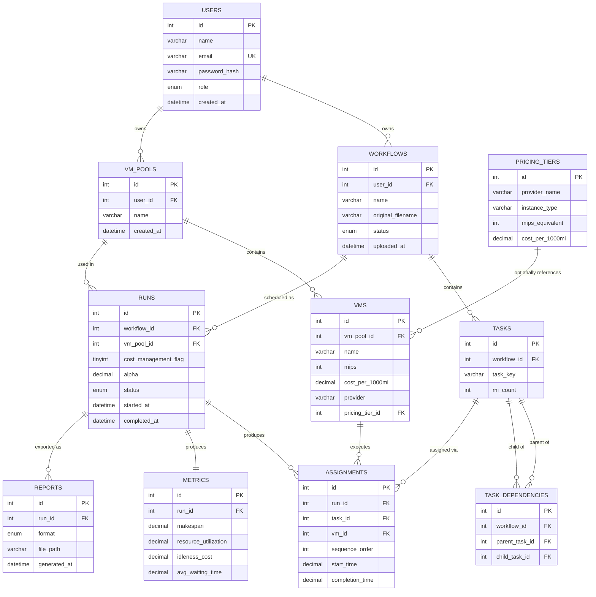

## 6.3 Table-to-Module Ownership

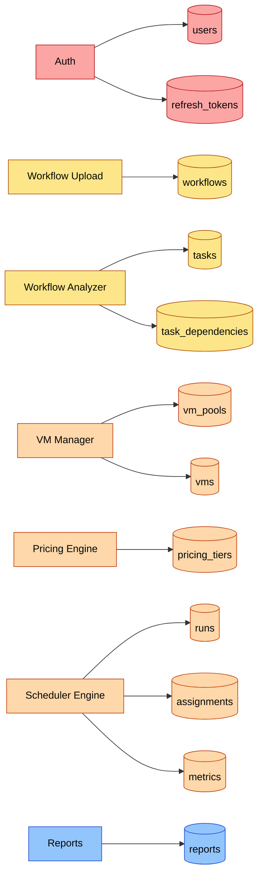

**[Added]** `refresh_tokens` is owned by the Authentication module (5.1), supporting FR-AUTH-3's refresh-token issuance and the rotation/revocation design described there.

## 6.4 DDL (Key Tables)

```sql
CREATE TABLE users (
    id INT AUTO_INCREMENT PRIMARY KEY,
    name VARCHAR(120) NOT NULL,
    email VARCHAR(160) NOT NULL UNIQUE,
    password_hash VARCHAR(255) NOT NULL,
    role ENUM('user','administrator','evaluator') NOT NULL DEFAULT 'user',
    created_at DATETIME NOT NULL DEFAULT CURRENT_TIMESTAMP
);

-- [Added] Supports FR-AUTH-3 (refresh token issuance) and the rotation/revocation
-- design in §5.1. Only the token hash is ever stored, never the raw token.
CREATE TABLE refresh_tokens (
    id INT AUTO_INCREMENT PRIMARY KEY,
    user_id INT NOT NULL,
    token_hash CHAR(64) NOT NULL,   -- SHA-256 hex digest of the raw refresh token
    expires_at DATETIME NOT NULL,
    revoked_at DATETIME NULL,       -- set on rotation or on detected reuse
    created_at DATETIME NOT NULL DEFAULT CURRENT_TIMESTAMP,
    FOREIGN KEY (user_id) REFERENCES users(id) ON DELETE CASCADE,
    UNIQUE KEY uq_token_hash (token_hash),
    INDEX idx_refresh_tokens_user (user_id)
);

CREATE TABLE workflows (
    id INT AUTO_INCREMENT PRIMARY KEY,
    user_id INT NOT NULL,
    name VARCHAR(160) NOT NULL,
    original_filename VARCHAR(255) NOT NULL,
    status ENUM('uploaded','parsed','invalid') NOT NULL DEFAULT 'uploaded',
    uploaded_at DATETIME NOT NULL DEFAULT CURRENT_TIMESTAMP,
    FOREIGN KEY (user_id) REFERENCES users(id),
    INDEX idx_workflows_user (user_id)
);

CREATE TABLE tasks (
    id INT AUTO_INCREMENT PRIMARY KEY,
    workflow_id INT NOT NULL,
    task_key VARCHAR(20) NOT NULL,
    mi_count INT NOT NULL CHECK (mi_count > 0),
    FOREIGN KEY (workflow_id) REFERENCES workflows(id) ON DELETE CASCADE,
    UNIQUE KEY uq_task_per_workflow (workflow_id, task_key),
    INDEX idx_tasks_workflow (workflow_id)
);

CREATE TABLE task_dependencies (
    id INT AUTO_INCREMENT PRIMARY KEY,
    workflow_id INT NOT NULL,
    parent_task_id INT NOT NULL,
    child_task_id INT NOT NULL,
    FOREIGN KEY (workflow_id) REFERENCES workflows(id) ON DELETE CASCADE,
    FOREIGN KEY (parent_task_id) REFERENCES tasks(id) ON DELETE CASCADE,
    FOREIGN KEY (child_task_id) REFERENCES tasks(id) ON DELETE CASCADE,
    UNIQUE KEY uq_edge (parent_task_id, child_task_id)
);

CREATE TABLE vm_pools (
    id INT AUTO_INCREMENT PRIMARY KEY,
    user_id INT NOT NULL,
    name VARCHAR(120) NOT NULL,
    created_at DATETIME NOT NULL DEFAULT CURRENT_TIMESTAMP,
    FOREIGN KEY (user_id) REFERENCES users(id)
);

CREATE TABLE pricing_tiers (
    id INT AUTO_INCREMENT PRIMARY KEY,
    provider_name VARCHAR(80) NOT NULL,
    instance_type VARCHAR(80) NOT NULL,
    mips_equivalent INT NOT NULL,
    cost_per_1000mi DECIMAL(10,4) NOT NULL CHECK (cost_per_1000mi >= 0)
);

CREATE TABLE vms (
    id INT AUTO_INCREMENT PRIMARY KEY,
    vm_pool_id INT NOT NULL,
    name VARCHAR(80) NOT NULL,
    mips INT NOT NULL CHECK (mips > 0),
    cost_per_1000mi DECIMAL(10,4) NOT NULL CHECK (cost_per_1000mi >= 0),
    provider VARCHAR(80) NULL,
    pricing_tier_id INT NULL,
    deleted_at DATETIME NULL,  -- [Added] soft-delete marker; see §5.4 DELETE /api/vm-pools/:id/vms/:vmId
    FOREIGN KEY (vm_pool_id) REFERENCES vm_pools(id) ON DELETE CASCADE,
    FOREIGN KEY (pricing_tier_id) REFERENCES pricing_tiers(id)
);

CREATE TABLE runs (
    id INT AUTO_INCREMENT PRIMARY KEY,
    workflow_id INT NOT NULL,
    vm_pool_id INT NOT NULL,
    cost_management_flag TINYINT NOT NULL DEFAULT 0,
    alpha DECIMAL(3,2) NULL CHECK (alpha >= 0 AND alpha <= 1),
    status ENUM('running','completed','failed') NOT NULL DEFAULT 'running',
    started_at DATETIME NOT NULL DEFAULT CURRENT_TIMESTAMP,
    completed_at DATETIME NULL,
    FOREIGN KEY (workflow_id) REFERENCES workflows(id),
    FOREIGN KEY (vm_pool_id) REFERENCES vm_pools(id),
    INDEX idx_runs_workflow (workflow_id)
);

CREATE TABLE assignments (
    id INT AUTO_INCREMENT PRIMARY KEY,
    run_id INT NOT NULL,
    task_id INT NOT NULL,
    vm_id INT NOT NULL,
    sequence_order INT NOT NULL,
    start_time DECIMAL(10,4) NOT NULL,
    completion_time DECIMAL(10,4) NOT NULL,
    FOREIGN KEY (run_id) REFERENCES runs(id) ON DELETE CASCADE,
    FOREIGN KEY (task_id) REFERENCES tasks(id),
    FOREIGN KEY (vm_id) REFERENCES vms(id),
    INDEX idx_assignments_run (run_id)
);

CREATE TABLE metrics (
    id INT AUTO_INCREMENT PRIMARY KEY,
    run_id INT NOT NULL UNIQUE,
    makespan DECIMAL(10,4) NOT NULL,
    resource_utilization DECIMAL(6,4) NOT NULL,
    idleness_cost DECIMAL(12,4) NOT NULL,
    avg_waiting_time DECIMAL(10,4) NOT NULL,
    FOREIGN KEY (run_id) REFERENCES runs(id) ON DELETE CASCADE
);

CREATE TABLE reports (
    id INT AUTO_INCREMENT PRIMARY KEY,
    run_id INT NOT NULL,
    format ENUM('pdf','csv') NOT NULL,
    file_path VARCHAR(255) NOT NULL,
    generated_at DATETIME NOT NULL DEFAULT CURRENT_TIMESTAMP,
    FOREIGN KEY (run_id) REFERENCES runs(id) ON DELETE CASCADE
);
```

## 6.5 Normalization Notes

- **3NF throughout:** task definitions (`tasks`, `task_dependencies`) live independently of any specific `run`, so one workflow can be scheduled many times (different VM pools/α) without duplicating DAG data.
- **`metrics` is 1:1 with `runs`**, not folded into the `runs` table itself — keeps the "run configuration" (input) cleanly separated from "run results" (output).
- **`assignments` is the fact table** tying together `runs`, `tasks`, and `vms` — this is where Gantt-chart rendering (5.7) reads from directly.

## 6.6 Indexing Strategy

| Table | Index | Rationale |
|---|---|---|
| `workflows` | `idx_workflows_user` | List "my workflows" quickly (`NFR-PERF-4`) |
| `tasks` | `idx_tasks_workflow` | Fast DAG reconstruction per workflow |
| `runs` | `idx_runs_workflow` | List run history per workflow |
| `assignments` | `idx_assignments_run` | Fast Gantt-chart query per run |

### Summary
The schema separates workflow/task definitions from run-specific results, letting one workflow be re-scheduled under different VM pools or α values without data duplication — directly supporting the α-sensitivity experiments described in Chapter 3 of the Developer Playbook (Table 3 reproduction).

### Key Points
- `tasks`/`task_dependencies` are workflow-scoped; `assignments`/`metrics` are run-scoped. Don't conflate the two when writing queries.
- `pricing_tiers` is optional reference data — a VM's own `cost_per_1000mi` is always authoritative unless explicitly tied to a tier.

### Implementation Checklist
- [ ] Do all foreign keys have `ON DELETE CASCADE` where deleting the parent should clean up dependents (e.g., deleting a workflow removes its tasks)?
- [ ] Is `alpha` constrained to `[0,1]` at the database level, not just in application code?

### Review Questions (sample)
1. Why is `metrics` a separate table from `runs` instead of extra columns on `runs`?
2. What would break if `task_dependencies` referenced `workflow_id` implicitly through tasks only, without its own `workflow_id` column?

### Future Improvements
- Add a `schema_version` or migration-tracking table once the project moves past the initial review milestone.

---

---

# Chapter 3 — Low-Level Design

## 3.1 Overview

This chapter translates the modules of Chapter 5 into concrete classes, functions, and data structures. Backend and Scheduler decomposition are covered here; Frontend component-level design is deferred to Chapter 8, and the full scheduling algorithm walkthrough is deferred to Chapter 9 — this chapter gives the structural skeleton both build on.

## 3.2 Backend Class/Function Decomposition

| Layer | Unit | Key Methods | Notes |
|---|---|---|---|
| Controller | `AuthController` | `register(req,res)`, `login(req,res)`, `me(req,res)` | Thin — validates request shape, delegates to service |
| Controller | `WorkflowController` | `upload(req,res)`, `getById(req,res)`, `list(req,res)`, `schedule(req,res)` | `schedule()` invokes the Scheduler Bridge |
| Controller | `VmPoolController` | `create(req,res)`, `addVm(req,res)`, `getById(req,res)` | |
| Controller | `ReportController` | `generate(req,res)`, `download(req,res)` | |
| Service | `AuthService` | `hashPassword()`, `verifyPassword()`, `issueToken()`, `verifyToken()` | Wraps bcrypt + jsonwebtoken |
| Service | `WorkflowService` | `parseAndPersist(fileBuffer)`, `detectCycle(tasks, edges)` | Calls into Analyzer logic |
| Service | `SchedulerBridgeService` | `runSchedule(dag, vmPool, costFlag, alpha)` | Spawns the Python process, returns parsed JSON |
| Service | `PricingService` | `resolveCost(vm)` | Falls back to `vm.cost_per_1000mi` if no `pricing_tier_id` |
| Service | `ReportService` | `buildPdf(run)`, `buildCsv(run)` | |
| Model (data access) | `UserModel`, `WorkflowModel`, `TaskModel`, `VmModel`, `RunModel`, `AssignmentModel`, `MetricModel`, `ReportModel` | Standard CRUD per Ch. 6 tables | Thin query wrappers, no business logic |
| Middleware | `authMiddleware` | `verify(req,res,next)` | Rejects before controller runs if JWT invalid/missing |
| Middleware | `errorHandler` | `handle(err,req,res,next)` | Maps error types → HTTP status (Ch. 2 §2.5) |

## 3.3 Scheduler Class Decomposition (Python)

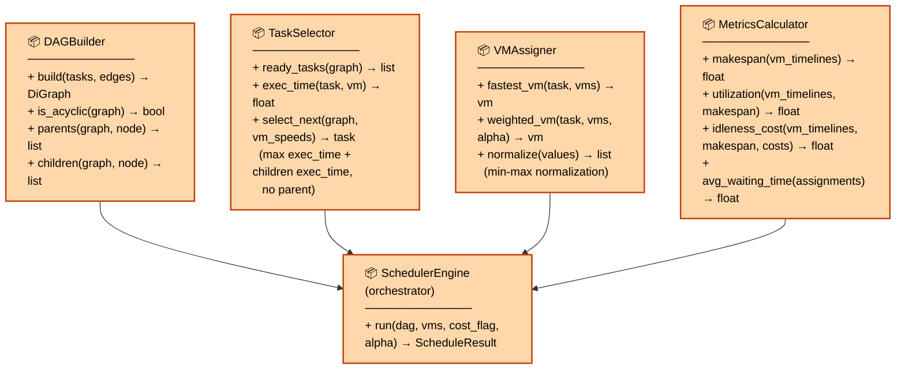

**Design intent:** each class owns exactly one concern from Algorithm 2 — graph mechanics (`DAGBuilder`), task-selection rule (`TaskSelector`), VM-assignment rule (`VMAssigner`), and reporting (`MetricsCalculator`). `SchedulerEngine` is the only class that knows the *order* in which these are called, matching the Algorithm 2 loop exactly (`Source: Research Paper`).

## 3.4 Key Data Structures

```python
# Conceptual shapes (language-agnostic; realized as dict/NamedTuple/DataClass in Python,
# and as TypeScript interfaces at the API boundary — see Chapter 7)

Task = {
    "id": int,
    "task_key": str,       # e.g. "a", "b"
    "mi_count": int,
}

Edge = {
    "parent_task_id": int,
    "child_task_id": int,
}

VM = {
    "id": int,
    "name": str,
    "mips": int,
    "cost_per_1000mi": float,
}

ScheduleResult = {
    "assignments": [
        {"task_id": int, "vm_id": int, "sequence_order": int,
         "start_time": float, "completion_time": float}
    ],
    "metrics": {
        "makespan": float,
        "resource_utilization": float,
        "idleness_cost": float,
        "avg_waiting_time": float,
    },
}
```

`DAGBuilder.build()` internally uses a NetworkX `DiGraph`, with each node storing its `mi_count` as a node attribute — this is what `is_acyclic()` and `parents()/children()` operate on directly, matching the reference implementation's data model (Source: Research Paper, Section 3).

## 3.5 Function-Level Skeleton — Scheduler Engine Loop

```python
def run(dag, vms, cost_flag, alpha=None):
    """
    Orchestrates Algorithm 2. Source: Research Paper for the control flow;
    Engineering Extension only in error handling / return shape.
    """
    remaining = dag.copy()
    vm_timelines = {vm.id: [] for vm in vms}   # list of (task_id, start, end)

    while remaining.number_of_nodes() > 0:
        for vm in idle_vms(vm_timelines):
            ready = TaskSelector.ready_tasks(remaining)
            if not ready:
                break
            task = TaskSelector.select_next(remaining, ready, vm_speeds(vms))

            if cost_flag == 0:
                target_vm = VMAssigner.fastest_vm(task, vms)
            else:
                target_vm = VMAssigner.weighted_vm(task, vms, alpha)

            assign(task, target_vm, vm_timelines)
            remaining.remove_node(task.id)

    metrics = MetricsCalculator.compute_all(vm_timelines, vms)
    return ScheduleResult(assignments=flatten(vm_timelines), metrics=metrics)
```

### Summary
The backend follows a conventional controller → service → model layering; the scheduler is decomposed into four single-purpose classes orchestrated by one engine class whose call order mirrors Algorithm 2 exactly. This keeps the paper-fidelity constraint (§1.5.1) auditable at the function level, not just the module level.

### Key Points
- `TaskSelector.select_next()` and `VMAssigner.weighted_vm()` are the two functions a code reviewer should check first for algorithmic fidelity — they encode Algorithm 2's two core decision points.
- Controllers stay thin; all business logic lives in services, all algorithm logic lives in the scheduler classes — never in a controller.

### Implementation Checklist
- [ ] Does `TaskSelector.select_next()` implement "max(exec_time + children exec_time), no parent" exactly, with no shortcuts?
- [ ] Does `VMAssigner.weighted_vm()` apply min-max normalization before combining with α, per Algorithm 2 line 17?

### Review Questions (sample)
1. Why does `SchedulerEngine.run()` contain no HTTP, database, or file-handling code?
2. Which class would you modify to add a new baseline algorithm (e.g., plain Min–Min) without touching `SchedulerEngine`?

### Future Improvements
- Extract `TaskSelector`/`VMAssigner` behind a strategy interface so baseline algorithms (Min–Min, SJF) can be swapped in for comparison runs without duplicating `SchedulerEngine`.

---

# Chapter 4 — Component Design

## 4.1 Overview

Where Chapter 3 defines *classes and functions*, this chapter defines *contracts* between components — what each one promises to accept, promises to return, and promises to do on failure. This is the level of detail a developer needs to implement one component correctly without reading another component's internals.

## 4.2 Component Contracts

| Component | Interface | Preconditions | Postconditions | Error Contract |
|---|---|---|---|---|
| `AuthService` | `issueToken(user) → jwt` | `user` exists and password verified | Returns signed JWT with `exp` claim | Throws `InvalidCredentialsError` → controller maps to `401` |
| `WorkflowService` | `parseAndPersist(file) → workflow` | File passed upload validation (5.2) | `workflow.status ∈ {parsed, invalid}`; if `invalid`, offending edge is included | Throws `CyclicGraphError`/`MalformedFileError` → `422` |
| `SchedulerBridgeService` | `runSchedule(dag, vmPool, costFlag, alpha) → ScheduleResult` | `dag` is acyclic; `vmPool` non-empty; `alpha ∈ [0,1]` if `costFlag=1` | Persists `runs`/`assignments`/`metrics`; returns `run_id` | Throws `SchedulerProcessError` (non-zero exit) → `500`; `SchedulerTimeoutError` → `504` |
| `PricingService` | `resolveCost(vm) → decimal` | `vm` exists | Always returns a non-negative decimal | Never throws — falls back to `vm.cost_per_1000mi` |
| `ReportService` | `buildPdf(run) / buildCsv(run) → filePath` | `run.status = completed` | File written outside webroot; `reports` row created | Throws `RunNotCompleteError` → `409` |

## 4.3 Component Interaction — Detailed Contract View

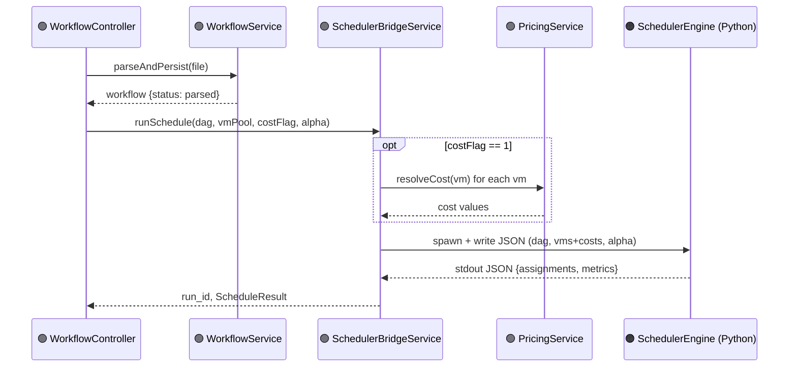

**Contract note:** `SchedulerBridgeService` — not `SchedulerEngine` itself — is responsible for calling `PricingService`. This keeps the Python scheduler's input contract simple (it always receives fully-resolved cost numbers, never has to know about `pricing_tiers` lookups), preserving Design Constraint §1.5.1's "no deviation from Algorithm 2" by keeping cost-resolution *outside* the algorithm's own logic.

## 4.4 Error Propagation Contract

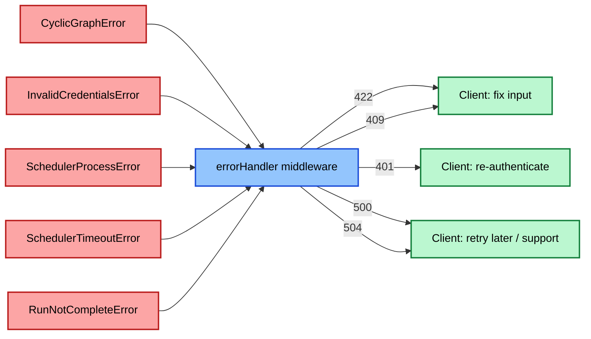

Every component throws a **typed error**, never a raw string or generic `Error`. The single `errorHandler` middleware (Ch. 2 §2.5) is the only place HTTP status codes are decided — individual services and components never set status codes themselves, keeping that mapping in one auditable location.

### Summary
Component contracts define the promises each unit makes independent of implementation — critically, cost resolution is pulled out of the Scheduler Engine and into the Bridge layer, so the algorithm itself stays a pure, paper-faithful function of (DAG, VM+cost data, α).

### Key Points
- `SchedulerEngine` never talks to `PricingService` directly — that boundary is what keeps the algorithm's implementation "clean" for fidelity auditing.
- All error types are typed classes, mapped to HTTP status in exactly one place.

### Implementation Checklist
- [ ] Does every thrown error in the codebase have a corresponding row in the Error Contract table above?
- [ ] Can you point to the single file where HTTP status codes are decided?

### Review Questions (sample)
1. Why does `SchedulerBridgeService`, not `SchedulerEngine`, own the call to `PricingService`?
2. What's the practical benefit of centralizing HTTP status-code decisions in one `errorHandler`?

### Future Improvements
- Add a correlation ID to each error context so a failure can be traced end-to-end across WorkflowController → SchedulerBridgeService → SchedulerEngine logs.

---

---

# Chapter 7 — API Design

## 7.1 Conventions

| Aspect | Convention |
|---|---|
| Base URL | `/api` |
| Auth | `Authorization: Bearer <jwt>` header on all routes except `/auth/register`, `/auth/login` |
| Response envelope (success) | `{ "data": <payload> }` |
| Response envelope (error) | `{ "error": { "code": "...", "message": "..." } }` |
| Pagination | `?limit=&offset=` on all list endpoints; response includes `{ "data": [...], "total": n }` |
| Content type | `application/json`, except upload (`multipart/form-data`) and report download (`application/pdf` / `text/csv`) |

## 7.2 Authentication

### `POST /api/auth/register`
| | |
|---|---|
| **Purpose** | Create a new user account |
| **Request** | `{ "name": string, "email": string, "password": string }` |
| **Response (201)** | `{ "data": { "id": int, "name": string, "email": string, "role": "user" } }` |
| **Validation** | Email format; password ≥ 8 chars; email uniqueness |
| **Errors** | `400` malformed body · `409` email already registered |

### `POST /api/auth/login`
| | |
|---|---|
| **Purpose** | Authenticate and receive a JWT |
| **Request** | `{ "email": string, "password": string }` |
| **Response (200)** | `{ "data": { "token": string, "expires_in": int } }` |
| **Validation** | Both fields required |
| **Errors** | `401` invalid credentials · `429` too many attempts (rate limited, Ch. 10) |

### `GET /api/auth/me`
| | |
|---|---|
| **Purpose** | Return the authenticated user's profile |
| **Response (200)** | `{ "data": { "id": int, "name": string, "email": string, "role": string } }` |
| **Errors** | `401` missing/expired token |

### `POST /api/auth/refresh` **[Added — implements FR-AUTH-3]**
| | |
|---|---|
| **Purpose** | Exchange a valid refresh token for a new access token, without re-entering credentials |
| **Request** | `{ "refresh_token": string }` |
| **Response (200)** | `{ "data": { "token": string, "expires_in": int, "refresh_token": string } }` — a **new** refresh token is always returned (rotation); the one just used is immediately revoked |
| **Validation** | Token hash must match an unrevoked, unexpired `refresh_tokens` row |
| **Errors** | `401` invalid/expired/already-used refresh token (reuse of a revoked token additionally revokes the whole token family server-side, per §5.1) |

## 7.3 Workflows

### `POST /api/workflows`
| | |
|---|---|
| **Purpose** | Upload a workflow file and parse it into a DAG |
| **Request** | `multipart/form-data`: `name` (string), `file` (binary) |
| **Response (201)** | `{ "data": { "id": int, "name": string, "status": "parsed" \| "invalid", "task_count": int } }` |
| **Validation** | Whitelisted extension; max size (e.g. 5 MB); non-empty; must parse to an acyclic graph |
| **Errors** | `413` file too large · `415` unsupported type · `422` cyclic/malformed graph (includes offending edge) |

### `GET /api/workflows`
| | |
|---|---|
| **Purpose** | List the current user's workflows |
| **Query params** | `limit`, `offset`, `status` (optional filter) |
| **Response (200)** | `{ "data": [ {id, name, status, uploaded_at} ], "total": int }` |
| **Errors** | `401` unauthenticated |

### `GET /api/workflows/:id`
| | |
|---|---|
| **Purpose** | Retrieve a workflow's parsed task/edge structure |
| **Response (200)** | `{ "data": { "id": int, "name": string, "status": string, "tasks": [...], "edges": [...] } }` |
| **Errors** | `404` not found · `403` not owner |

### `POST /api/workflows/:id/schedule`
| | |
|---|---|
| **Purpose** | Run the Scheduler Engine against this workflow |
| **Request** | `{ "vm_pool_id": int, "cost_management_flag": 0 \| 1, "alpha": float (required if flag=1) }` |
| **Response (202)** | `{ "data": { "run_id": int, "status": "running" } }` — client polls `GET /api/runs/:id` |
| **Validation** | `vm_pool_id` must belong to caller and be non-empty; `alpha ∈ [0,1]` when flag=1; workflow must be `parsed` |
| **Errors** | `409` workflow not parsed · `422` invalid alpha/empty pool · `500` scheduler process error · `504` scheduler timeout |

## 7.4 VM Pools

### `POST /api/vm-pools`
| | |
|---|---|
| **Purpose** | Create a new VM pool |
| **Request** | `{ "name": string }` |
| **Response (201)** | `{ "data": { "id": int, "name": string } }` |

### `POST /api/vm-pools/:id/vms`
| | |
|---|---|
| **Purpose** | Add a VM to a pool |
| **Request** | `{ "name": string, "mips": int, "cost_per_1000mi": decimal, "provider": string (optional) }` |
| **Response (201)** | `{ "data": { "id": int, "name": string, "mips": int, "cost_per_1000mi": decimal } }` |
| **Validation** | `mips > 0`; `cost_per_1000mi >= 0` |
| **Errors** | `403` not pool owner · `422` invalid values |

### `GET /api/vm-pools/:id`
| | |
|---|---|
| **Purpose** | Retrieve a pool and its VMs |
| **Response (200)** | `{ "data": { "id": int, "name": string, "vms": [...] } }` |
| **Errors** | `404` not found |

### `PUT /api/vm-pools/:id/vms/:vmId` **[Added — implements FR-VM-1's "update"]**
| | |
|---|---|
| **Purpose** | Update an existing VM's name, MIPS, cost rate, or provider label |
| **Request** | `{ "name": string (optional), "mips": int (optional), "cost_per_1000mi": decimal (optional), "provider": string (optional) }` |
| **Response (200)** | `{ "data": { "id": int, "name": string, "mips": int, "cost_per_1000mi": decimal, "provider": string } }` |
| **Validation** | Same as creation (`mips > 0`, `cost_per_1000mi >= 0`) for any field supplied |
| **Errors** | `403` not pool owner · `404` VM not found · `409` VM already used in a completed run — `mips`/`cost_per_1000mi` cannot be changed (name/provider still may be) |

### `DELETE /api/vm-pools/:id/vms/:vmId` **[Added — implements FR-VM-1's "delete"]**
| | |
|---|---|
| **Purpose** | Remove a VM from a pool |
| **Response (204)** | No content |
| **Validation** | If the VM has any `assignments` from a past run, this is a **soft delete** (`vms.deleted_at` set; VM excluded from future run configuration but historical assignments remain valid) rather than a hard row delete |
| **Errors** | `403` not pool owner · `404` VM not found |

## 7.5 Pricing

### `GET /api/pricing-tiers`
| | |
|---|---|
| **Purpose** | Browse reference multi-cloud pricing tiers *(Engineering Enhancement)* |
| **Query params** | `provider` (optional filter) |
| **Response (200)** | `{ "data": [ {id, provider_name, instance_type, mips_equivalent, cost_per_1000mi} ] }` |

## 7.6 Runs & Reports

### `GET /api/runs/:id`
| | |
|---|---|
| **Purpose** | Retrieve a run's status, schedule, and metrics |
| **Response (200)** | `{ "data": { "id": int, "status": string, "assignments": [...], "metrics": {...} } }` |
| **Errors** | `404` not found · `403` not owner/evaluator |

### `GET /api/runs/:id/compare` **[Added — previously missing; implements FR-DASH-4]**
| | |
|---|---|
| **Purpose** | Compare the Advanced Cost-Aware Max–Min run against classical Max–Min, Min–Min, and SJF runs of the *same* workflow + VM pool, on shared metrics |
| **Response (200)** | `{ "data": { "workflow_id": int, "vm_pool_id": int, "runs": [ { "algorithm": string, "run_id": int, "makespan": float, "avg_waiting_time": float, "utilization_pct": float, "idleness_cost": float } ] } }` |
| **Validation** | All compared runs must share `workflow_id` and `vm_pool_id`; at least 2 completed runs required |
| **Errors** | `404` no runs found for this workflow · `409` fewer than 2 completed runs for this workflow/pool combination |

### `POST /api/runs/:id/report`
| | |
|---|---|
| **Purpose** | Generate a downloadable report for a completed run |
| **Request** | `{ "format": "pdf" \| "csv" }` |
| **Response (201)** | `{ "data": { "report_id": int, "download_url": string } }` |
| **Validation** | Run must be `completed` |
| **Errors** | `409` run not complete · `422` unsupported format |

### `GET /api/reports/:id/download`
| | |
|---|---|
| **Purpose** | Download a previously generated report file |
| **Response (200)** | Binary file stream (`application/pdf` or `text/csv`) |
| **Errors** | `404` not found · `403` not owner |

### Summary
The REST surface is small and resource-oriented: Auth, Workflows, VM Pools, Pricing, and Runs/Reports — with the Scheduler Engine deliberately *not* exposed as its own public endpoint (it's only reachable indirectly via `POST /api/workflows/:id/schedule`, per the Scheduler Bridge contract in Ch. 2/4).

### Key Points
- Scheduling is asynchronous (`202` + poll), not synchronous — this matters for `NFR-PERF` since large DAGs may take longer than a typical HTTP timeout.
- Every error response uses the same envelope shape, so frontend error handling is uniform across endpoints.

### Implementation Checklist
- [ ] Does every endpoint above have an integration test covering both its success and at least one error path?
- [ ] Is the `202` + polling pattern actually implemented for `/schedule`, or does it currently block synchronously? (Flag this now if it's still synchronous — it's a known gap to close before load-testing.)

### Review Questions (sample)
1. Why is scheduling designed as `202 Accepted` + polling rather than a blocking `200` response?
2. Why isn't there a `POST /api/scheduler/run` endpoint that calls the Scheduler Engine directly?

### Future Improvements
- WebSocket or Server-Sent Events channel for real-time run-status push instead of polling.

---

# Chapter 8 — Frontend Design

## 8.1 Site Map / Navigation Flow

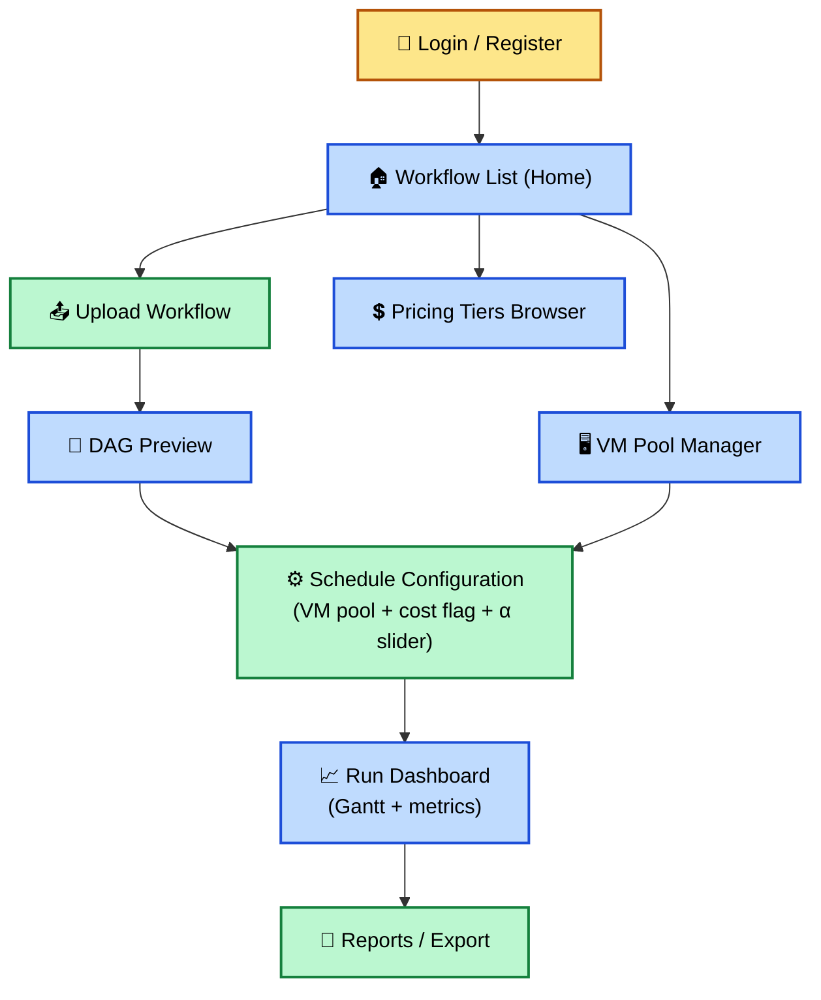

## 8.2 Pages

| Page | Purpose | Key Data |
|---|---|---|
| Login / Register | Auth entry point | `AuthService` |
| Workflow List (Home) | Browse/search uploaded workflows | `GET /api/workflows` |
| Upload Workflow | File upload + parse feedback | `POST /api/workflows` |
| DAG Preview | Visual confirmation of parsed structure before scheduling | `GET /api/workflows/:id` |
| VM Pool Manager | CRUD for VM pools/VMs | `GET/POST /api/vm-pools` |
| Schedule Configuration | Choose VM pool, cost flag, α (if flag=1) | `POST /api/workflows/:id/schedule` |
| Run Dashboard | Gantt timeline + makespan/utilization/idleness-cost cards | `GET /api/runs/:id` (polled while `running`) |
| Reports / Export | Trigger and download PDF/CSV | `POST /api/runs/:id/report`, `GET /api/reports/:id/download` |
| Pricing Tiers Browser | Reference multi-cloud rates | `GET /api/pricing-tiers` |

## 8.3 Component Hierarchy (Run Dashboard, as example)

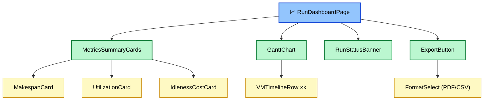

## 8.4 State Management

- **Local component state** (`useState`) for form inputs (upload form, α slider, VM pool form).
- **Shared/request state** via a lightweight data-fetching layer (e.g., a `services/` API client + `useEffect`/polling hooks) — no global store like Redux is introduced, consistent with the "avoid complicated enterprise architecture" tech-stack guidance (Developer Playbook, Ch. 5).
- **Auth state** (JWT + current user) held in a single `AuthContext` at the app root, read by route guards and the Navbar.
- **Polling:** Run Dashboard polls `GET /api/runs/:id` on an interval while `status === "running"`, stops on `completed`/`failed`.

## 8.5 Responsive Design Notes

| Breakpoint | Behavior |
|---|---|
| Mobile (< 640px) | Gantt chart becomes horizontally scrollable; metrics cards stack vertically |
| Tablet (640–1024px) | Two-column metrics card grid |
| Desktop (> 1024px) | Full Gantt width, three-column metrics cards, sidebar navigation visible |

### Summary
The frontend follows a page → component → leaf-component hierarchy with local/context state only — deliberately no heavyweight state-management library, matching the project's "avoid complicated enterprise architecture" constraint. The Run Dashboard polls rather than pushes, consistent with the REST-only design in Chapter 7.

### Key Points
- `AuthContext` is the only global state; everything else is local or fetched-on-demand.
- DAG Preview exists as its own step *before* Schedule Configuration so users can catch a bad upload before configuring a run — this mirrors the fail-fast principle from Chapter 5 (Workflow Analyzer).

### Implementation Checklist
- [ ] Does the Run Dashboard stop polling once a run reaches a terminal state (`completed`/`failed`)?
- [ ] Are form validation errors shown field-by-field (per `NFR-USE-2`), not as a single generic banner?

### Review Questions (sample)
1. Why does DAG Preview exist as a separate page rather than being folded into the Upload page?
2. Why was Redux/global state management deliberately avoided here?

### Future Improvements
- Replace polling with WebSocket/SSE push once the backend supports it (ties to Ch. 7's future improvement).

---

---

# Chapter 9 — Scheduler Design (Deep Dive)

## 9.1 Purpose of This Chapter

Chapters 3 and 5.5 gave the scheduler's structural skeleton. This chapter is the authoritative, implementation-ready specification of Algorithm 2 itself — the one chapter where **zero deviation** from the source paper is permitted for the core logic (Design Constraint §1.5.1). Anything here not explicitly attributed to the paper is marked `Engineering Extension` and exists only to make an underspecified edge case deterministic.

## 9.2 Recap — Inputs and Outputs

| | |
|---|---|
| **Inputs** | DAG (tasks with `mi_count`, dependency edges), VM list (`mips`, `cost_per_1000mi`), `cost_management_flag` (0/1), `alpha ∈ [0,1]` if flag=1 |
| **Outputs** | Task execution order, per-task VM assignment + start/completion time, makespan, resource utilization, idleness cost, average waiting time |

## 9.3 Step-by-Step Walkthrough (annotated against the paper's Fig. 1 example)

Using the paper's own 5-task example: V={a,b,c,d,e}, E={ab,ac,bd,cd,de}, sizes 15000/8000/9000/5000/6000 MI.

1. **Extract dependencies:** `parent(d) = {a,b,c}`, `children(a) = {b,c,d,e}`.
2. **While unexecuted tasks remain and a VM is idle:**
   a. **Fetch step:** among tasks with no unscheduled parent, compute `exec_time(t) + Σ exec_time(children(t))` for each candidate — select the maximum. Initially only `a` has no parent, so `a` is selected regardless of the formula's value.
   b. **Assign step:**
      - If `cost_management_flag = 0`: assign to the VM minimizing `exec_time(t)` on that VM (i.e., "completes fastest").
      - If `cost_management_flag = 1`: compute completion time and cost for `t` on every VM, min-max normalize each across VMs, then assign to the VM minimizing `α × norm_completion_time + (1-α) × norm_cost`.
   c. **Remove step:** delete `t` and its outgoing edges from the working DAG; this may make new tasks "ready" (no remaining parent).
3. **Repeat** until the DAG is empty.
4. **Compute metrics** (Eq. 1–3) from the completed per-VM timelines.

## 9.4 Full Pseudocode

```text
ALGORITHM AdvancedCostAwareMaxMin(DAG, VMs, cost_flag, alpha):
    # Source: Research Paper — Algorithm 2. Do not alter selection rules.

    extract parent(x), children(x) for all x in DAG          # Source: Research Paper

    WHILE DAG has unexecuted tasks:
        WHILE all VMs are busy:
            WAIT until one VM becomes idle
        FOR EACH idle VM:
            ready := { t in DAG : parent(t) is empty }
            IF ready is empty: BREAK                          # no eligible task yet
            t := argmax over ready of
                    ( exec_time(t) + SUM(exec_time(c) for c in children(t)) )
                                                                # Source: Research Paper, Algorithm 2 line 11
                    # Engineering Extension: on a tie, break by lowest task_id
                    # (deterministic — paper does not specify a tie-break rule)

            IF cost_flag == 0:
                vm := argmin over VMs of completion_time(t, vm)
                                                                # Source: Research Paper, line 13
            ELSE:
                FOR EACH vm in VMs:
                    ct[vm] := completion_time(t, vm)
                    cost[vm] := cost_per_1000mi(vm) * (mi_count(t) / 1000)
                norm_ct := min_max_normalize(ct)
                norm_cost := min_max_normalize(cost)
                vm := argmin over VMs of
                        ( alpha * norm_ct[vm] + (1 - alpha) * norm_cost[vm] )
                                                                # Source: Research Paper, line 17
                # Engineering Extension: on a tie, prefer the lower-cost VM,
                # then the lowest vm_id (deterministic — paper does not specify)

            execute t on vm; record start_time, completion_time
            remove t and its outgoing edges from DAG            # Source: Research Paper, line 18

    RETURN assignments, makespan(Eq.1), utilization(Eq.2), idleness_cost(Eq.3)
```

## 9.5 Flowchart

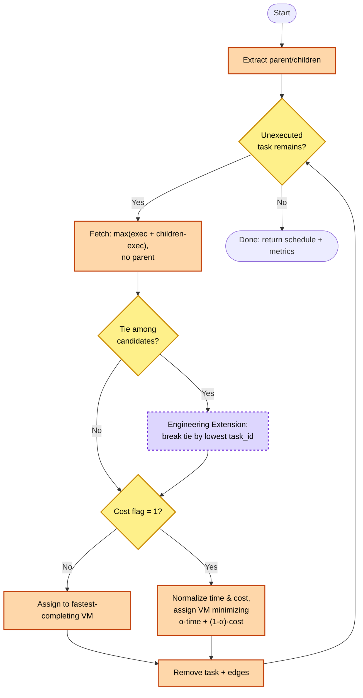

## 9.6 Tie-Breaking Rules *(Engineering Extension — the paper does not specify these)*

| Situation | Rule Applied | Rationale |
|---|---|---|
| Two ready tasks have equal `exec_time + children exec_time` | Lowest `task_id` wins | Deterministic, reproducible test results |
| Two VMs give equal completion time (`cost_flag=0`) | Lowest `vm_id` wins | Deterministic |
| Two VMs give equal `α·norm_ct + (1-α)·norm_cost` (`cost_flag=1`) | Lower-cost VM wins, then lowest `vm_id` | Favors cost-efficiency when otherwise indifferent |

## 9.7 Edge Cases

| Case | Behavior |
|---|---|
| **[Added]** Empty DAG (zero tasks) | Loop condition (`while unexecuted tasks remain`) is never entered; the system returns immediately with `makespan = 0`, `utilization = 0`, `idleness_cost = 0`, `avg_waiting_time = 0`, and an empty assignment list, without invoking the VM-selection branch at all (FR-SCH-11) |
| Single-task DAG | Immediately ready; assigned per cost flag; makespan = its own completion time |
| Multiple independent applications (disconnected DAG components) | Each component's root becomes "ready" simultaneously — this is exactly the scenario the paper's Advanced algorithm fixes vs. Workflow Max–Min (concurrent, not sequential, execution) |
| Task with no children (leaf) | `children exec_time` term = 0; selection reduces to its own `exec_time` |
| More idle VMs than ready tasks | Idle VMs simply wait; no error — loop re-evaluates as new tasks become ready |
| `alpha = 1` | Weighted term reduces to pure completion-time minimization — behaviorally equivalent to `cost_flag=0` (matches paper's Table 3 observation) |
| `alpha = 0` | All tasks route to the lowest-cost VM regardless of speed (matches paper's Table 3 observation of makespan spiking once α approaches 0) |
| Zero-cost VM declared | Valid (`cost_per_1000mi >= 0` per Ch. 6 constraint); normalization still well-defined unless *all* VMs are zero-cost, in which case cost term contributes 0 uniformly |

## 9.8 Time Complexity

**O(mn²)**, where *m* = number of VMs, *n* = number of tasks (Source: Research Paper — stated explicitly as matching classical Max–Min's complexity, since the algorithm does not exhaustively search all task/VM combinations at the fetch step). This is explicitly *not* a complexity improvement over classical Max–Min — the paper's contribution is schedule *quality* (makespan, cost, utilization), not asymptotic speed.

## 9.9 Space Complexity *(Engineering Extension — not stated in the paper)*

O(n + e) to hold the DAG (n tasks, e edges) plus O(m) for per-VM timelines — linear in workflow and VM-pool size, not a scaling concern for realistic workflow sizes.

## 9.10 Optimization Notes

- Compute the ETC matrix (`exec_time` per task per VM) once per scheduling run and cache it — it depends only on immutable `mi_count`/`mips` values, not on scheduling state.
- Update `parent()`/`children()` incrementally on each task removal rather than recomputing from the full edge list every iteration (Chapter 2's "Common Mistakes" note, Developer Playbook Ch. 2).
- Normalization (`min_max_normalize`) only needs to be computed over the *currently available* VMs at each fetch step, not the full historical set.

## 9.11 Validation Strategy

1. **Worked-example reproduction:** run the implementation against the paper's Fig. 1/Fig. 2 examples and confirm the makespan improvement (6.4 → 5.9) reported in Fig. 4.
2. **α-sensitivity reproduction:** reproduce the qualitative pattern in Table 3 (makespan rises, cost falls, as α → 0) using an equivalent task set.
3. **Trend reproduction (not exact-value reproduction):** since your own random task sets will differ from the paper's, validate *trends* — Advanced ≤ Workflow Max–Min/Min–Min/SJF on makespan and idleness cost — not exact numeric matches.

## 9.12 Baseline Algorithms Design *(Added — implements FR-SCH-6, previously undesigned)*

FR-SCH-6 requires classical Max–Min, Min–Min, and Shortest-Job-First (SJF) as comparison baselines. These are in-scope for v1.0 (not future work), so — unlike the Advanced algorithm — there is no "no deviation" constraint on them; each follows its own classical definition.

**Design approach:** a `TaskSelectionStrategy` interface (Strategy pattern) sits behind `SchedulerEngine`, so all four algorithms share the same DAG-loading, VM-assignment-loop, and metrics-computation code (Eq. 1–3, §9.4's `WHILE` structure) — only the *task-selection rule* differs per algorithm. This keeps Design Constraint §1.5.1 intact: the Advanced algorithm's own strategy class is untouched by adding the other three.

| Algorithm | Task-Selection Rule | Dependency Handling |
|---|---|---|
| Classical Workflow Max–Min | Among ready tasks, select the one with the **maximum** `exec_time(t)` alone (no children term) | Same ready-set/removal mechanics as §9.4, minus the children-lookahead term |
| Min–Min | Among ready tasks, select the one with the **minimum** `exec_time(t)` on its fastest available VM | Same ready-set/removal mechanics |
| Shortest-Job-First (SJF) | Select the ready task with the smallest `mi_count` outright (VM-agnostic ranking, then assign to the fastest available VM) | Same ready-set/removal mechanics |

- **VM assignment:** all three baselines use the `cost_flag = 0` assignment rule (fastest-completion VM) from §9.4 — none of them define a cost-aware variant, consistent with FR-SCH-6's note that baselines "need not account for task dependencies beyond what each baseline classically supports."
- **Tie-breaking:** the same deterministic rule as §9.6 (lowest `task_id`, then lowest `vm_id`) is applied for consistency and reproducible test results, and is likewise disclosed as an `Engineering Extension` rather than part of any of these algorithms' classical definitions.
- **Metrics:** makespan/utilization/idleness-cost (Eq. 1–3) are computed identically across all four algorithms from the resulting per-VM timelines, which is what makes the `GET /api/runs/:id/compare` endpoint (Ch. 7) a fair, apples-to-apples comparison.
- **Validation:** §7.1's trend-reproduction strategy (Advanced ≤ baselines on makespan/idleness cost) depends on all three baselines being implemented per their standard definitions above — an incorrectly "easy" or "hard" baseline would invalidate that comparison.

### Summary
This chapter is the ground truth for scheduler correctness. Sections 9.3–9.5 are pure `Source: Research Paper`; sections 9.6 and 9.9 are `Engineering Extension` filling gaps the paper leaves open; §9.12 is an `Engineering Extension` by necessity — the baselines are classical algorithms not covered by the paper's own Algorithm 2 — clearly separated so a reviewer can audit fidelity independently of your added determinism.

### Key Points
- The paper leaves tie-breaking undefined — your tie-break rules (9.6) are a legitimate, disclosed engineering decision, not a deviation from the algorithm's substance.
- Complexity stays O(mn²) — don't claim a complexity improvement in your report; the paper is explicit that the gain is in schedule quality, not speed.

### Implementation Checklist
- [ ] Does your implementation reproduce the paper's own Fig. 1/Fig. 4 makespan values (6.4 → 5.9) on the same input?
- [ ] Are tie-breaks implemented deterministically, matching Table 9.6?

### Review Questions (sample)
1. Where exactly does this design deviate from the paper, and why is that deviation justified?
2. Why does α=1 behave identically to `cost_flag=0`?
3. What happens to the schedule when the input DAG has multiple disconnected components, and why is that the paper's central improvement over Workflow Max–Min?

### Future Improvements
- Exhaustive/near-exhaustive VM search at the fetch step as an optional "high-fidelity" mode, explicitly opt-in and separate from the paper-faithful default.

---

# Chapter 10 — Security Design

## 10.1 Defense-in-Depth Overview

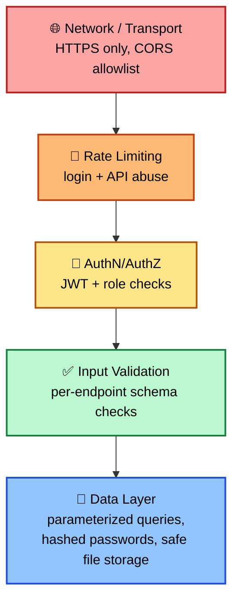

## 10.2 Authentication & Authorization

| Control | Design |
|---|---|
| Password storage | bcrypt with cost factor ≥ 10; plaintext never logged or persisted |
| Token | JWT, short expiry (e.g., 1 hour access token); `exp`/`iat` claims verified on every request |
| Authorization (RBAC) | Roles: `user` (own resources only), `administrator` (manage VM pools/pricing tiers globally), `evaluator` (read-only across runs for review purposes, per SRS §4.3 actor) |
| Route guarding | `authMiddleware` runs before every controller except `/auth/register`, `/auth/login`; role checks applied per-route where needed (e.g., pricing-tier management restricted to `administrator`) |

## 10.3 SQL Injection Prevention

- All database access goes through the Model layer (Ch. 3.2) using **parameterized queries / prepared statements** exclusively — no string-concatenated SQL anywhere in the codebase.
- Model layer is the *only* place raw SQL is written, making injection-surface auditing a single-directory review.

## 10.4 XXE Prevention

- If DAX/XML workflow import is enabled (Developer Playbook Ch. 2, "XML/DAX"), the XML parser **must** have external entity resolution and DTD processing disabled by default — this is a required configuration flag, not an opt-in.
- Rationale: XML External Entity (XXE) attacks are a well-known vector for file-disclosure/SSRF via seemingly-innocuous file uploads.

## 10.5 File Upload Validation

| Check | Rule |
|---|---|
| Extension whitelist | Only supported workflow formats (e.g., `.json`, `.csv`, `.xml`) accepted |
| Content sniffing | Actual file content validated server-side, not trusted from client-supplied MIME type/extension alone |
| Size limit | Hard cap (e.g., 5 MB) enforced before the file is fully buffered |
| Storage location | Outside webroot (per §1.6/§5.2); served only via an authenticated download endpoint, never a static file path |
| Filename handling | Server-generated storage filename (not the user-supplied name) to prevent path traversal |

## 10.6 Input Validation

- Every endpoint in Chapter 7 has an explicit validation rule set (see each endpoint's **Validation** row) — enforced at the API boundary before any service/controller logic runs.
- Validation errors return field-specific messages (`NFR-USE-2`), never a single opaque "invalid request."

## 10.7 Rate Limiting

- Login endpoint (`POST /api/auth/login`): limited per IP/email to mitigate brute-force (e.g., 5 attempts / 15 minutes → `429`).
- General API rate limiting per authenticated user to prevent abuse of the (comparatively expensive) `/schedule` endpoint.

## 10.8 CORS

- Allowlist of known frontend origins only (dev + deployed frontend URL); no wildcard (`*`) origin in production, since requests carry an `Authorization` header.

## 10.9 Secrets Management

- DB credentials, JWT signing secret, and any pricing-tier data-source credentials live in environment variables, never committed to Git (per Developer Playbook Ch. 4, Phase 6 checklist).

### Summary
Security is layered from the network boundary inward: transport/CORS → rate limiting → authentication/authorization → input validation → safe data access — with specific, mandatory hardening for the two highest-risk surfaces in this system: file upload (workflow files) and XML parsing (DAX import).

### Key Points
- XXE protection is **mandatory**, not optional, the moment XML/DAX import is enabled — this is the single highest-risk feature in the system's attack surface.
- The Model layer is the sole location for raw SQL — keep it that way for auditability.

### Implementation Checklist
- [ ] Is XML parsing configured with external entities and DTDs disabled by default?
- [ ] Are uploaded files stored under a server-generated name outside the webroot?
- [ ] Does the login endpoint reject after N failed attempts within a time window?

### Review Questions (sample)
1. Why is content-sniffing necessary even after extension whitelisting?
2. Why must the Model layer be the only place raw SQL is written?
3. What specific attack does disabling external entity resolution prevent?

### Future Improvements
- Add refresh-token rotation and a token-revocation list (addressing the limitation noted in Ch. 5.1).

---

---

# Chapter 11 — Failure Analysis

## 11.1 Failure Mode Table

| Failure | Reason | Impact | Detection | Solution | Recovery | Prevention |
|---|---|---|---|---|---|---|
| Circular dependency in workflow | User-uploaded DAG contains a cycle | Cannot compute `parent()`/`children()`; scheduling impossible | `DAGBuilder.is_acyclic()` check at parse time (Ch. 5.3) | Reject at upload, return offending edge | User edits/re-uploads workflow | Validate before persisting `task_dependencies` |
| Invalid/malformed XML (DAX import) | Corrupt file or XXE-style malicious payload | Parse failure or (if unmitigated) file-disclosure risk | Parser exception; XXE-hardened parser rejects external entities outright | Reject with `422`; never attempt best-effort recovery of malformed XML | User re-uploads valid file | XXE-safe parser config as a hard requirement (Ch. 10.4) |
| File upload failure | Oversized file, disallowed type, or storage write error | Workflow never created | Multer validation (size/type) fires before controller logic; disk-write errors caught | Return specific `413`/`415`/`500`; clean up any partial file | Retry upload | Enforce limits before buffering full file |
| Database connection failure | DB down, connection pool exhausted, network partition | All persistence-dependent requests fail | Connection pool error events; health-check endpoint fails | Return `503`; queue is not attempted (no write-behind buffer in v1.0) | Reconnect on DB recovery; client retries | Connection pooling with sane limits; DB monitoring (12.6) |
| Scheduler process crash | Unhandled exception in Python scheduler (e.g., unexpected VM/task shape) | Run marked `failed`; no partial results persisted | Non-zero exit code from spawned process, caught by `SchedulerBridgeService` | Return `500`; log full stderr for debugging | User can re-trigger `/schedule` | Input already validated (acyclic DAG, non-empty VM pool) before invocation reduces crash surface |
| Scheduler timeout | Pathologically large DAG or VM pool causes excessive runtime | Request hangs past acceptable wait | Bridge-level timeout on the spawned process | Kill process, return `504`, mark run `failed` | User can retry, possibly with a smaller workflow | Document practical DAG-size limits; consider async job queue (Ch. 7 future improvement) |
| Scheduler Bridge IPC failure | Malformed/truncated JSON on stdout, broken pipe | Bridge cannot parse scheduler output | JSON parse exception in `SchedulerBridgeService` | Return `500`; treat as scheduler failure | Retry `/schedule` | Scheduler always writes a single well-formed JSON object on exit, even on internal error, so the Bridge has something structured to parse |
| Expired/invalid JWT | Token past `exp`, tampered, or missing | Request rejected before reaching business logic | `authMiddleware` signature/expiry check | Return `401` | Client re-authenticates (login again) | Reasonable token expiry window; no route bypasses the middleware |
| No VM available (empty pool selected) | User selects a VM pool with zero VMs, or all VMs removed after pool creation | Scheduling cannot proceed | Validated in `POST /schedule` before invoking Bridge | Return `422` with a clear message | User adds VMs to the pool, retries | Prevent deletion of a pool's last VM if pool is referenced by an active run (design decision to confirm with SRS during implementation) |
| Pricing resolution failure | VM references a `pricing_tier_id` that no longer exists | Cost term of α equation cannot be resolved via tier lookup | `PricingService.resolveCost()` tier lookup miss | Fall back to VM's own `cost_per_1000mi` (never blocks scheduling) | N/A — self-healing by design | `PricingService` never throws (Ch. 4.2 contract) |
| Report generation failure | Run not yet `completed`, or PDF/CSV rendering error | No report produced | `ReportService` precondition check; rendering exception caught | Return `409` (not complete) or `500` (rendering fault) | User retries after run completes / reports a rendering bug | Precondition check happens before any rendering work begins |
| Concurrent schedule requests for the same workflow | User double-submits or opens two tabs | Duplicate/wasted scheduler runs, potential race on `runs` row | Application-level check for an existing `running` run on the same workflow | Reject the second request with `409` until the first completes | User waits for the in-flight run or checks Run Dashboard | Idempotency guard keyed on `(workflow_id, status=running)` |

## 11.2 Detailed Walkthrough — Scheduler Process Crash

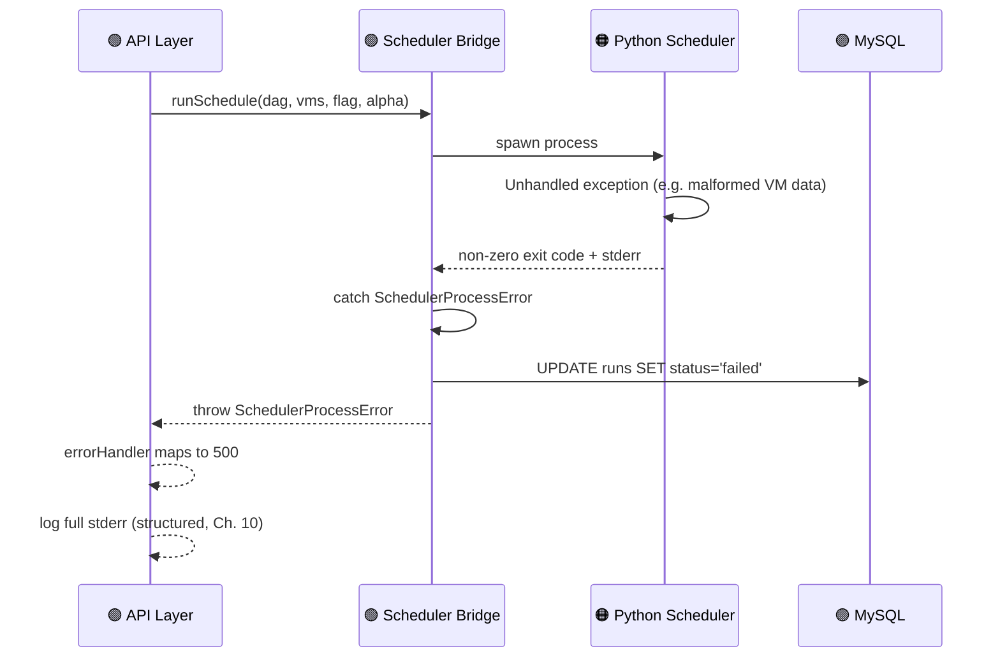

**Why no partial results are persisted:** a crashed run's in-progress `vm_timelines` state is not a valid `ScheduleResult` — persisting it would let an incomplete/incorrect schedule appear in the Dashboard as if it were real. Fail-safe defaults (§1.9) require this to surface as a clean `failed` state instead.

## 11.3 Detailed Walkthrough — Circular Dependency Detected

1. Workflow Analyzer builds the graph from uploaded edges.
2. `DAGBuilder.is_acyclic()` returns `false`.
3. `WorkflowService` throws `CyclicGraphError`, including the specific edge that closes the cycle (traced via NetworkX's cycle-finding utility).
4. `workflows.status` is set to `invalid` — the row is kept (not silently discarded) so the user can see *what* they uploaded and *why* it failed.
5. API returns `422` with the offending edge in the error payload, so the frontend can highlight it in the DAG Preview.

## 11.4 Detailed Walkthrough — Database Failure

1. Connection pool reports an error (e.g., connection refused, pool exhausted).
2. Any in-flight request touching the Model layer fails; `errorHandler` maps this to `503 Service Unavailable` (distinct from `500`, signaling "try again shortly" rather than "something is broken in the code").
3. Health-check endpoint (Ch. 12.6) begins failing, surfacing the outage to monitoring before users report it.
4. On DB recovery, the connection pool reconnects automatically (standard pool behavior); no manual intervention needed unless the outage was prolonged enough to require an app restart.
5. **Not implemented in v1.0:** a write-behind queue to buffer requests during an outage — flagged as a future improvement, not a current guarantee.

### Summary
Every failure mode maps to a specific, typed error and a specific HTTP status (consistent with Ch. 4.4's error propagation contract) — nothing fails silently, and nothing partially-completed is presented to the user as if it succeeded.

### Key Points
- The system's fail-safe default (§1.9) — reject before reaching the scheduler, never persist partial/incorrect results — is the thread connecting every row of the table above.
- `PricingService` is the one component designed to *never* fail outward; every other component has an explicit failure contract.

### Implementation Checklist
- [ ] Does every failure mode above have a corresponding automated test (simulated crash, simulated DB outage, etc.)?
- [ ] Is `workflows.status = 'invalid'` preserved (not deleted) so users can see what went wrong?

### Review Questions (sample)
1. Why is a crashed scheduler run never allowed to persist partial results?
2. Why does a database failure return `503` rather than `500`?
3. What idempotency guard prevents duplicate concurrent schedule requests for the same workflow?

### Future Improvements
- Write-behind request buffering during brief DB outages.
- Structured alerting (not just logging) on scheduler crash-rate thresholds.

---

# Chapter 12 — Deployment Design

## 12.1 Deployment Topology

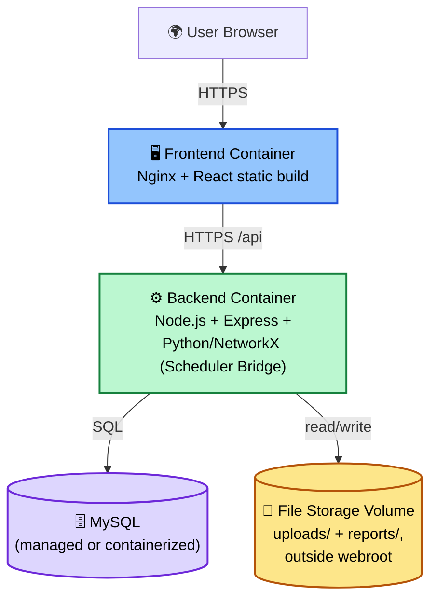

**Design note (traceable to §1.5.3/§1.7):** Backend and Scheduler are packaged into **one container image** — Node.js and the Python/NetworkX runtime co-located — because the Scheduler Bridge communicates via local process spawn/IPC, not a network call. This is the containerized expression of "single logical backend service," not a microservice split.

## 12.2 Containerization

| Image | Base | Contents |
|---|---|---|
| `infralytix-frontend` | `nginx:alpine` | Compiled React static build |
| `infralytix-backend` | `node:20-slim` + Python 3.11 layer | Express app, `scheduler/` Python scripts, NetworkX + dependencies installed via `requirements.txt` |
| `mysql` | `mysql:8` (or managed cloud MySQL) | Schema from Ch. 6.4 applied via migration/init script |

`docker-compose.yml` (or equivalent) wires these three together for local/demo deployment; Docker itself remains **optional** per the Developer Playbook's tech-stack notes — a non-containerized deployment (Node + Python + MySQL installed directly on a single host) is equally valid for a review-panel demo.

## 12.3 Environment Variables

| Variable | Purpose |
|---|---|
| `NODE_ENV` | `development` \| `production` |
| `PORT` | Backend listen port |
| `DB_HOST`, `DB_PORT`, `DB_USER`, `DB_PASSWORD`, `DB_NAME` | MySQL connection |
| `JWT_SECRET` | Token signing key — never committed to Git |
| `JWT_EXPIRES_IN` | Access token lifetime |
| `UPLOAD_DIR` | Absolute path outside webroot for uploaded workflow files |
| `REPORTS_DIR` | Absolute path outside webroot for generated reports |
| `SCHEDULER_SCRIPT_PATH` | Path to the Python entry point invoked by the Scheduler Bridge |
| `SCHEDULER_TIMEOUT_MS` | Max wait before the Bridge kills a hung scheduler process (Ch. 11) |
| `RATE_LIMIT_WINDOW_MS`, `RATE_LIMIT_MAX` | Login/API rate limiting (Ch. 10.7) |
| `CORS_ALLOWED_ORIGINS` | Comma-separated allowlist (Ch. 10.8) |

## 12.4 Production Deployment Checklist

- [ ] All secrets sourced from environment/secret manager, none hardcoded or committed.
- [ ] `NODE_ENV=production` set (disables verbose stack traces in error responses).
- [ ] Database schema (Ch. 6.4) applied via a versioned migration, not manual ad-hoc SQL.
- [ ] `UPLOAD_DIR`/`REPORTS_DIR` confirmed outside the web-served static root.
- [ ] HTTPS termination configured (reverse proxy or platform-provided TLS).
- [ ] CORS allowlist restricted to the actual deployed frontend origin.
- [ ] Health-check endpoint reachable by whatever uptime monitoring is in use.

## 12.5 Logging Strategy

- Structured JSON logs at two boundaries (per Ch. 2.5): **API layer** (method, path, status, duration, user id) and **Scheduler Bridge** (invocation params minus sensitive data, exit code, duration).
- Log levels: `error` (failures needing attention), `warn` (recoverable issues, e.g., pricing-tier fallback), `info` (normal request/run lifecycle events).
- Passwords, JWTs, and full file contents are **never** logged, even at `debug` level.

## 12.6 Monitoring

| Signal | Why It Matters |
|---|---|
| `GET /health` (DB connectivity + basic liveness) | Fast external check for uptime monitoring |
| Scheduler run duration (p50/p95) | Detects DAG sizes/VM pools pushing toward the timeout threshold (Ch. 11) |
| Scheduler failure rate | Rising crash rate signals a regression in input validation or the algorithm implementation itself |
| DB connection pool utilization | Early warning before a full connection-exhaustion failure (Ch. 11.4) |
| `401`/`429` rate on `/auth/login` | Signals brute-force attempts (Ch. 10.7) |

## 12.7 Backup & Rollback

- **Database backups:** scheduled MySQL dumps (or managed-provider automated backups) — sufficient for a project-review deployment; point-in-time recovery is a future improvement, not a v1.0 requirement.
- **Rollback:** container images are tagged per release; rolling back means redeploying the previous image tag plus (if needed) reverting the most recent schema migration.
- **File storage:** uploads/reports volume backed up alongside the database backup cadence, since `assignments`/`reports` rows reference file paths that must remain valid.

### Summary
Deployment keeps the single-logical-service constraint intact at the container level — backend and scheduler ship together — while frontend and database remain independently deployable. Environment variables, logging, and monitoring are designed so a failure surfaces as a specific, traceable signal rather than silent degradation.

### Key Points
- Backend + Scheduler are **one image**, not two — this is a direct, deliberate consequence of the Scheduler Bridge's spawn/IPC contract (§1.5.6), not an oversight.
- Every environment variable in 12.3 maps to a specific design decision made earlier in this document — nothing here is arbitrary configuration.

### Implementation Checklist
- [ ] Can you point to the Dockerfile line where the Python runtime is installed into the backend image?
- [ ] Is there a documented, tested rollback procedure, not just a forward deployment path?

### Review Questions (sample)
1. Why are the backend and scheduler packaged into a single container image rather than two?
2. What's the difference between what `GET /health` checks and what "scheduler failure rate" monitoring checks?

### Future Improvements
- Point-in-time database recovery.
- Autoscaling the backend tier once concurrent-user load is characterized (ties to Ch. 2.6's "revisit networked scheduler" note).

---

# Appendix B — Requirement Traceability Matrix *(Added)*

Chapter 1.2 promises to "map every module design back to its originating FR/NFR identifiers." The chapters above mostly cite SRS *section* numbers (§3.x) rather than individual IDs; this appendix closes that gap with an explicit FR-ID / NFR-ID → design-location table, now that the actual SRS v1.0 requirement IDs are available.

| Requirement ID | Design Location |
|---|---|
| FR-AUTH-1 – FR-AUTH-2 | §5.1 (Authentication module), §7.2 (`POST /api/auth/register`, `/login`), Ch.6 `users` DDL |
| FR-AUTH-3 (refresh token) | §5.1 "Refresh Token Design" *(Added)*, §7.2 `POST /api/auth/refresh` *(Added)*, Ch.6 `refresh_tokens` DDL *(Added)* |
| FR-AUTH-4 – FR-AUTH-5 | §5.1, Ch.10 (JWT middleware, rate limiting) |
| FR-UP-1 – FR-UP-5 | §5.2 (Workflow Upload), §7.3 `POST/GET /api/workflows` |
| FR-DAG-1 – FR-DAG-4 | §5.3 (Workflow Analyzer), Ch.6 `tasks`/`task_dependencies` DDL |
| FR-VM-1 (create/list) | §5.4 (VM Manager), §7.4 `POST /api/vm-pools`, `POST /api/vm-pools/:id/vms`, `GET /api/vm-pools/:id` |
| FR-VM-1 (update/delete) | §5.4 *(Added)*, §7.4 `PUT`/`DELETE /api/vm-pools/:id/vms/:vmId` *(Added)*, Ch.6 `vms.deleted_at` *(Added)* |
| FR-VM-2 – FR-VM-3 | §5.4 validation rules |
| FR-SCH-1 – FR-SCH-5, FR-SCH-7 – FR-SCH-9 | Ch.9 §9.3–9.4 (Advanced algorithm pseudocode + Eq. 1–3) |
| FR-SCH-6 (baseline algorithms) | §9.12 *(Added — previously undesigned)* |
| FR-SCH-10 (tie-break) | §9.6 |
| FR-SCH-11 (empty DAG / single-task) | §9.7 *(empty-DAG row Added)* |
| FR-SCH-12 (worked-example validation) | §9.11 |
| FR-PRC-1 – FR-PRC-3 | §5.6 (Pricing Engine) — *note: §5.6 also designs tiered/multi-provider pricing beyond the SRS's linear-cost-only constraint (§2.5); flagged for your review, not altered here* |
| FR-DASH-1 – FR-DASH-3 | §5.7 (Dashboard), §7.6 `GET /api/runs/:id` |
| FR-DASH-4 (algorithm comparison) | §5.7 *(Added)*, §7.6 `GET /api/runs/:id/compare` *(Added — previously missing)* |
| FR-REP-1 – FR-REP-2 | §5.8 (Reports), §7.6 `POST /api/runs/:id/report`, `GET /api/reports/:id/download` |
| NFR-PERF-1 – NFR-PERF-2 | §1.4, Ch.9 §9.8–9.10 |
| NFR-PERF-3 (pagination) | §7.1 Conventions |
| NFR-PERF-4 | SRS §7.1 stress-testing requirement; test plan itself is outside this SDD's scope |
| NFR-SEC (all) | Ch.10 (Security Design) |
| NFR-USE-1 – NFR-USE-2 | §4.1 (`<AlphaSlider>`), Ch.8 |
| NFR-MAINT-1 – NFR-MAINT-2 | §1.4, §12.5 (Logging), §12.1 (single-container deployment) |

**Not yet in the SRS but present in this design** (flagged, not resolved, per your instruction not to force reconciliation): `vm_pools` as a grouping concept above individual VMs, `pricing_tiers` multi-provider cost lookup, and `users.role`-based Evaluator/Administrator access are all SDD-level Engineering Enhancements. If you want them formally required, they need corresponding FR entries added to the SRS (see the companion SRS changelog).

---

# Document Complete

All 12 chapters of the Infralytix SDD are now included above, each traceable to either the SRS (`Source: Research Paper` / SRS section references) or explicitly flagged as an `Engineering Extension` where the SRS/paper was silent and a deterministic design decision was required.

**Before this goes to reviewers, worth double-checking:**
1. The `FR-*`/`NFR-*` mappings in Ch. 1.4 and throughout — these were inferred from the codes you referenced, not copied from your actual SRS text. Cross-check wording against SRS v1.0.
2. The Scheduler Bridge's spawn/IPC constraint (§1.5.6) vs. the earlier Infralytix Developer Playbook's architecture chapter, which sketched a more service-like call — reconcile if your real SRS says otherwise.
3. Tie-breaking rules (Ch. 9.6) and space-complexity note (Ch. 9.9) are disclosed Engineering Extensions, not paper content — make sure your viva answer draws that line clearly.

---

## Changelog — v1.1 *(this update)*

Cross-checked against the actual SRS v1.0 you provided. Additions made (all marked **[Added]** inline), nothing removed or reconciled:

- §5.1 / §7.2 / Ch.6: refresh-token issuance, rotation, and revocation design (FR-AUTH-3) — was previously only a "Future Improvement."
- §5.1: role-based (Evaluator/Administrator) access-control design (supports the `users.role` column already in the schema).
- §5.4 / §7.4 / Ch.6: VM update/delete endpoints and soft-delete column (FR-VM-1's "update, delete" was previously undesigned).
- §5.7 / §7.6: `GET /api/runs/:id/compare` endpoint (FR-DASH-4) — was previously missing entirely.
- §9.7: empty-DAG edge case (FR-SCH-11) — previously only single-task DAG was covered.
- §9.12 (new section): design for the three baseline algorithms — classical Max–Min, Min–Min, SJF (FR-SCH-6) — previously mentioned only in a guide question, never actually designed.
- Appendix B (new): full FR-*/NFR-* → design-location traceability matrix, fulfilling the mapping promised in §1.2.

**Still flagged, not resolved:** `vm_pools`, `pricing_tiers`, and `users.role` remain SDD-only concepts with no corresponding SRS requirement. They're noted in Appendix B rather than removed or force-matched, per your instruction.
