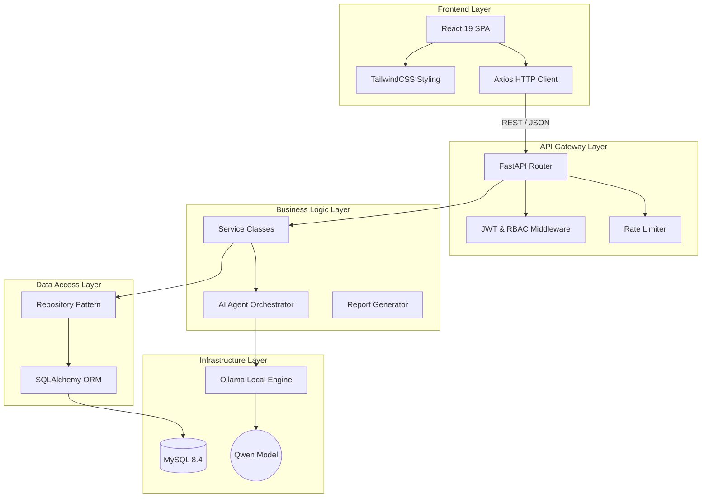

<div align="center">
  
# Infralytix

**AI-Powered Developer Infrastructure Operating System**

*An intelligent, multi-agent platform designed to automate, monitor, and optimize enterprise developer infrastructure through advanced AI integration.*

[](https://github.com/Sneharsha001/Infralytix/actions/workflows/ci.yml)
[](https://python.org)
[](https://fastapi.tiangolo.com)
[](https://react.dev)
[](https://mysql.com)
[](https://docker.com)
[](https://ollama.ai)
[](LICENSE)

</div>

---

## 📖 project overview

**What is Infralytix?**  
Infralytix is an enterprise-grade, multi-agent infrastructure automation platform. It leverages local AI (Ollama + Qwen) to understand codebases, generate infrastructure configurations, and monitor system health without exposing proprietary code to external APIs.

**Why was it built?**  
Modern software development requires navigating a complex labyrinth of CI/CD pipelines, containerization strategies, and cloud architectures. Infralytix was built to eliminate the boilerplate and cognitive load associated with DevOps, allowing developers to focus strictly on product features.

**What problems does it solve?**  
- Reduces the time spent configuring Dockerfiles and GitHub Actions.
- Identifies security vulnerabilities and architectural technical debt early.
- Demystifies complex infrastructure logs using AI-driven diagnostics.
- Provides unified observability over project health and deployment status.

**Who is it for?**  
Software Engineers, DevOps Professionals, Platform Engineers, and Tech Leads who want to streamline their infrastructure workflows securely using localized AI models.

---

## ✨ Key Features

| Feature Module | Description | Agent Capability |
|----------------|-------------|------------------|
| 🔍 **Repository Intelligence** | Deep analysis of codebase languages, frameworks, and patterns. | Detects tech debt and structural anti-patterns. |
| 🐳 **Deployment Intelligence** | Automated generation of production-ready container configurations. | Creates tailored `Dockerfile` & `docker-compose.yml`. |
| 📈 **Infrastructure Monitoring** | Real-time observability of service liveness and readiness. | Monitors dependency health and performance. |
| 📊 **Log Intelligence** | AI-driven log parsing and error diagnosis. | Identifies root causes of infrastructure failures. |
| 🔒 **Security Intelligence** | Proactive scanning for vulnerabilities and exposed secrets. | Recommends remediation for misconfigurations. |
| ☁️ **Cloud Intelligence** | Infrastructure cost estimation for AWS/GCP/Azure. | Optimizes resource allocation and budget planning. |
| 🏗️ **Architecture Intelligence** | Automated generation of system architecture diagrams. | Visualizes dependencies and service interactions. |
| 📄 **Report Generation** | Comprehensive, exportable PDF infrastructure reports. | Summarizes project health and AI recommendations. |
| 🔐 **Authentication** | Secure, JWT-based authentication with Role-Based Access Control. | Ensures secure access to infrastructure controls. |
| 🎛️ **Dashboard** | Modern, glassmorphism-inspired React interface. | Provides a unified command center for operations. |
| 📁 **Project Management** | Organize repositories and infrastructure assets logically. | Manages multi-project lifecycles seamlessly. |

---

## 🏛️ Architecture

Infralytix employs a clean, layered architecture designed for scalability and maintainability.



**Layer Explanations:**
- **Frontend Layer:** A responsive, type-safe React 19 application styled with Tailwind CSS, communicating via Axios.
- **API Gateway Layer:** FastAPI handles routing, request validation via Pydantic, and enforces JWT authentication and rate limiting.
- **Business Logic Layer:** Encapsulates core application logic, decoupling business rules from HTTP transport. Orchestrates AI interactions.
- **Data Access Layer:** Implements the Repository Pattern using SQLAlchemy, abstracting database operations from the business logic.
- **Infrastructure Layer:** MySQL provides persistent relational storage, while Ollama hosts the local Qwen LLM for secure, private AI processing.

---

## 🛠️ Technology Stack

| Category | Technology | Purpose |
|----------|------------|---------|
| **Frontend** | React 19, TypeScript, TailwindCSS, React Router, Axios | High-performance, type-safe UI delivery. |
| **Backend** | Python 3.12, FastAPI, Pydantic v2 | Async API gateway and data validation. |
| **Database** | MySQL 8.4, SQLAlchemy 2.0, Alembic | Relational data persistence and schema migrations. |
| **AI** | Ollama, Qwen Model | Localized, private generative AI operations. |
| **DevOps** | Docker, Docker Compose, GitHub Actions | Container orchestration and CI/CD automation. |
| **Cloud** | AWS (Planned) | Future scalable infrastructure deployment. |
| **Authentication**| JWT, Role-Based Access Control (RBAC) | Secure authentication and fine-grained authorization. |
| **Testing** | Pytest, MyPy, Ruff | Unit testing, static type checking, and linting. |

---

## 📂 Project Structure

```text
infralytix/
├── backend/                  # Python FastAPI Backend
│   ├── app/                  # Application Root
│   │   ├── api/v1/           # API endpoints (versioned)
│   │   ├── core/             # Configuration, logging, exceptions
│   │   ├── database/         # Database connection and session management
│   │   ├── middlewares/      # Custom HTTP middlewares
│   │   ├── models/           # SQLAlchemy ORM models
│   │   ├── schemas/          # Pydantic validation schemas
│   │   ├── repositories/     # Data access layer (Repository Pattern)
│   │   ├── services/         # Business logic layer
│   │   ├── utils/            # Helper utilities and shared functions
│   │   └── main.py           # Application entry point
│   ├── alembic/              # Database migration scripts
│   ├── tests/                # Pytest test suite
│   ├── Dockerfile            # Multi-stage Docker build
│   └── pyproject.toml        # Dependency & tool configuration
├── frontend/                 # React 19 Frontend
│   ├── src/                  # Source files
│   ├── package.json          # Node dependencies
│   └── vite.config.ts        # Vite build configuration
├── docs/                     # Project Documentation
│   ├── adr/                  # Architecture Decision Records
│   └── sprint-reviews/       # Agile sprint documentation
├── docker-compose.yml        # Production orchestration
├── docker-compose.dev.yml    # Development orchestration overrides
└── .env.example              # Environment variable template
```

---

## 🚀 Installation Guide

### Prerequisites
- [Docker](https://docs.docker.com/get-docker/) (v24+) & [Docker Compose](https://docs.docker.com/compose/install/) (v2+)
- [Python 3.12+](https://www.python.org/downloads/)
- [Node.js 20+](https://nodejs.org/)
- [Ollama](https://ollama.com/)

### 1. Clone the Repository
```bash
git clone https://github.com/Sneharsha001/Infralytix.git
cd Infralytix
```

### 2. Configure Environment Variables
```bash
cp .env.example .env
# Edit .env with your specific configuration values
```

### 3. Initialize AI (Ollama & Qwen)
Ensure Ollama is running locally, then pull the required model:
```bash
ollama run qwen
```

### 4. Start the Application
Start the infrastructure using Docker Compose:
```bash
# Production Mode
docker compose --env-file .env up -d

# Development Mode
docker compose -f docker-compose.yml -f docker-compose.dev.yml --env-file .env up -d
```

### 5. Verify Services
- **Backend API:** `http://localhost:8000/api/v1/health`
- **Frontend App:** `http://localhost:5173`

---

## ⚙️ Environment Variables

Below is a reference of the required variables (found in `.env.example`):

| Variable | Description | Example |
|----------|-------------|---------|
| `APP_ENV` | Application environment state | `development` / `production` |
| `BACKEND_PORT` | Port for the FastAPI server | `8000` |
| `FRONTEND_PORT` | Port for the React application | `5173` |
| `DB_HOST` | MySQL database host | `localhost` or `mysql` |
| `DB_PORT` | MySQL database port | `3306` |
| `DB_USER` | MySQL application username | `infralytix_user` |
| `DB_PASSWORD` | MySQL application password | `strong_password` |
| `MYSQL_ROOT_PASSWORD` | MySQL root administrative password | `root_password` |
| `SECRET_KEY` | 64-char hex key for JWT signing | `abc123...` |

---

## 📡 API Documentation

The RESTful API is versioned at `/api/v1`. 

### Major API Groups
- **Authentication:** JWT issuance and refresh logic.
- **Projects:** Workspace and repository management.
- **Agents:** Endpoints to trigger specific AI capabilities.
- **Monitoring:** System health and metric retrieval.
- **Repository:** Codebase structure and metadata analysis.
- **Deployment:** CI/CD and Docker configuration generation.
- **Logs:** Infrastructure log parsing and diagnostics.
- **Security:** Vulnerability scanning outcomes.
- **Reports:** Generation and retrieval of PDF audits.

*Interactive documentation (Swagger UI) is available at `/api/v1/docs`.*

---

## 📸 Screenshots

<details>
<summary>Click to view Application Screenshots</summary>

*(Placeholders for future UI screens)*

- **Dashboard:** `[Insert Dashboard Screenshot Here]`
- **Projects List:** `[Insert Projects Screenshot Here]`
- **Repository Analysis:** `[Insert Analysis Screenshot Here]`
- **Deployment Generation:** `[Insert Deployment Screenshot Here]`
- **Security Scan:** `[Insert Security Screenshot Here]`
- **Generated Reports:** `[Insert Report Screenshot Here]`

</details>

---

## 🗺️ Roadmap

### Sprint Progress

- [x] **Sprint S0:** Project Foundation & CI/CD
- [x] **README Reengineering:** Enterprise documentation upgrade
- [ ] **Sprint S1:** Backend Core Foundation (Architecture & Folder Structure) ⬅️ *Current Focus*
- [ ] **Sprint S2:** Database Layer & ORM Models
- [ ] **Sprint S3:** Authentication System (JWT/RBAC)

### Future Versions
- **v1.0 (MVP):** Local AI agent orchestration for Docker/CI generation, project management.
- **v2.0:** Cloud integrations (AWS/GCP), real-time infrastructure cost estimation, and advanced security scanning.

---

## 👨‍💻 Development Workflow

- **Branch Strategy:** Feature branches branched off `main` (e.g., `feature/s1-backend-core`).
- **Commit Convention:** [Conventional Commits](https://www.conventionalcommits.org/) format (e.g., `feat(core): add global exception handler`).
- **Code Style:** Enforced via `ruff` (Python) and `eslint`/`prettier` (TypeScript). Clean Architecture principles mandate strict separation of concerns.
- **Testing Strategy:** Pytest for backend unit/integration tests. GitHub Actions gates Pull Requests on test suite passage.

---

## 📚 Documentation

Detailed engineering documentation is referenced throughout development:
- **PRD:** Product Requirements Document
- **SRS:** Software Requirements Specification
- **SDD:** Software Design Document
- **Test Plan:** Quality assurance strategy
- **Deployment Guide:** CI/CD and operational instructions
- **Architecture Decision Records (ADRs):** Available in `docs/adr/`

---

## 🤝 Contributing

We welcome contributions! Please follow our standard operating procedure:
1. Fork the repository.
2. Create a feature branch.
3. Ensure all tests pass (`pytest` and `npm run test`).
4. Submit a Pull Request adhering to the coding standards and quality gates.

---

## 📄 License

This project is licensed under the **MIT License**. See the [LICENSE](LICENSE) file for details.

---

## 👤 Author

**Sneha Harsha**  
*Senior Platform Engineer & Software Architect*

[](https://linkedin.com)
[](https://github.com/Sneharsha001)
[](#)

---

## 🙏 Acknowledgements

- Built with the high-performance [FastAPI](https://fastapi.tiangolo.com/) framework.
- Powered by [Ollama](https://ollama.com/) and Alibaba's [Qwen](https://qwenlm.github.io/) models for localized AI.
- Styled elegantly with [Tailwind CSS](https://tailwindcss.com/).
