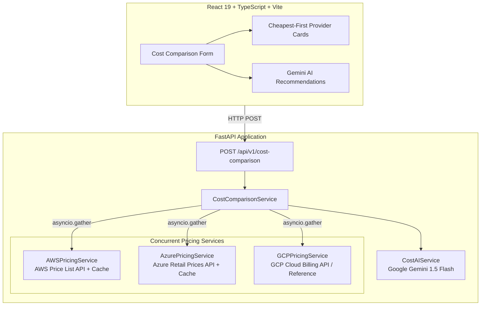

<div align="center">
  
# Infralytix

**Multi-Cloud Cost Comparison & Workload Optimization Engine**

*An intelligent tool to compare real-time pricing across AWS, Azure, and Google Cloud Platform (GCP) for any compute workload, complete with AI-powered architectural and cost recommendations.*

[](https://python.org)
[](https://fastapi.tiangolo.com)
[](https://react.dev)
[](https://typescriptlang.org)
[](https://vitejs.dev)
[](LICENSE)

</div>

---

## 📖 Overview

**Infralytix** is a multi-cloud cost comparison tool designed to evaluate compute, memory, and storage specifications against live pricing APIs across **Amazon Web Services (AWS)**, **Microsoft Azure**, and **Google Cloud Platform (GCP)**.

Given a resource requirement (vCPU, RAM, storage, region, hours/month), Infralytix queries the respective cloud pricing APIs concurrently, matches the closest virtual machine instances, computes monthly estimates (including attached high-performance block storage), ranks providers cheapest-first, and generates contextual AI suggestions via Google Gemini.

---

## ✨ Key Features

- **Live Cloud Pricing Integrations**:
  - **AWS EC2 & EBS**: Queries AWS's public Price List API with an in-memory 24-hour cache for on-demand Linux compute and gp3 storage.
  - **Azure Virtual Machines & Managed Disks**: Queries the live Azure Retail Prices API with OData filtering for Linux PAYG compute and Premium SSD storage.
  - **Google Cloud Platform (GCP)**: Queries the live GCP Cloud Billing Catalog API (`services/6F81-5844-456A/skus`) with an automated static reference catalogue fallback when `GCP_API_KEY` is not provided.
- **Unified Region Mapping**: Shared alias table mapping intuitive identifiers (`us-east`, `us-west`, `eu-west`, `us`, `eu`, `asia`) to provider-specific region codes (`us-east-1`, `eastus`, `us-east1`, etc.).
- **Concurrent Execution**: Fast, asynchronous evaluation of all cloud providers in parallel using Python's `asyncio.gather`.
- **AI Recommendation Engine**: Synthesizes cost-performance trade-offs, architecture architecture recommendations (e.g., ARM Graviton efficiency vs. x86 compatibility), and burstable vs. dedicated instance nuances via Google Gemini (with deterministic heuristic fallback).
- **Modern Responsive UI**: Single-page application built with React 19, TypeScript, and clean glassmorphism styling (`.glass-card`, `.btn-primary`), featuring workload presets, skeleton loaders, and cheapest-first highlighting.

---

## 🏛️ Architecture


```mermaid
flowchart TD
    subgraph Frontend [React 19 + TypeScript + Vite]
        UI[Cost Comparison Form]
        Cards[Cheapest-First Provider Cards]
        AISect[Gemini AI Recommendations]
        UI --> Cards
        UI --> AISect
    end

    subgraph Backend [FastAPI Application]
        Router["POST /api/v1/cost-comparison"]
        Orchestrator[CostComparisonService]
        Router --> Orchestrator

        subgraph Providers [Concurrent Pricing Services]
            AWS[AWSPricingService\nAWS Price List API + Cache]
            Azure[AzurePricingService\nAzure Retail Prices API + Cache]
            GCP[GCPPricingService\nGCP Cloud Billing API / Reference]
        end

        AI[CostAIService\nGoogle Gemini 1.5 Flash]

        Orchestrator -->|asyncio.gather| AWS
        Orchestrator -->|asyncio.gather| Azure
        Orchestrator -->|asyncio.gather| GCP
        Orchestrator --> AI
    end

    Frontend -- "HTTP POST" --> Router
```

---

## ⚙️ Environment Variables

Create or edit `backend/.env` (see `backend/.env.example` as reference):

| Variable | Required | Description |
|---|---|---|
| `GEMINI_API_KEY` | **Recommended** | Google Gemini API key used by `CostAIService` to generate workload insights. If unset or rate-limited, the service falls back automatically to deterministic rule-based advice. |
| `GCP_API_KEY` | Optional | Google Cloud API key for the GCP Cloud Billing Catalog API. If unset or invalid, GCP estimation transparently falls back to the curated static reference catalogue with a `"reference pricing"` badge. |
| `APP_ENV` | Optional | Application environment (`development` / `production`). Default: `development`. |
| `APP_PORT` | Optional | Backend port. Default: `8000`. |

*Note: AWS and Azure pricing APIs are public and require no API keys or credentials.*

---

## 🚀 Running the Project

### 1. Prerequisites
- **Python 3.12+**
- **Node.js 20+** and **npm**

### 2. Backend Setup
```bash
cd backend

# Create and activate virtual environment
python -m venv .venv
# Windows:
.venv\Scripts\activate
# macOS/Linux:
source .venv/bin/activate

# Install dependencies
pip install -r requirements.txt  # or: pip install -e .

# Configure environment variables
copy .env.example .env  # or cp on Linux/macOS
# Set GEMINI_API_KEY and optionally GCP_API_KEY in backend/.env

# Run FastAPI backend
uvicorn app.main:app --host 0.0.0.0 --port 8000 --reload
```
The API is available at `http://localhost:8000` (Swagger docs at `http://localhost:8000/docs`).

### 3. Frontend Setup
```bash
cd frontend

# Install dependencies
npm install

# Start Vite dev server (proxies /api/v1 to backend at http://localhost:8000)
npm run dev
```
Open `http://localhost:5173` in your browser.

---

## 📡 API Reference

### Cost Comparison Endpoint

- **Method**: `POST`
- **Path**: `/api/v1/cost-comparison`
- **Auth**: None (Public)

#### Request Body
```json
{
  "vcpu": 2,
  "ram_gb": 8,
  "storage_gb": 100,
  "region": "us-east",
  "hours_per_month": 730
}
```

#### Response (200 OK)
```json
{
  "estimates": [
    {
      "provider": "Azure",
      "instance_type_matched": "Standard_B2s",
      "monthly_cost_low": 47.38,
      "monthly_cost_high": 47.38,
      "currency": "USD",
      "notes": "Compute: $0.0416/hr ($30.37/mo for 730h) + Storage: $17.01/mo (100GB Premium SSD P10)",
      "error": null
    },
    {
      "provider": "AWS",
      "instance_type_matched": "t4g.large",
      "monthly_cost_low": 48.91,
      "monthly_cost_high": 48.91,
      "currency": "USD",
      "notes": "Compute: $0.0670/hr ($48.91/mo for 730h) + Storage: $8.00/mo (100GB gp3 @ $0.08/GB)",
      "error": null
    },
    {
      "provider": "GCP",
      "instance_type_matched": "e2-standard-2",
      "monthly_cost_low": 67.01,
      "monthly_cost_high": 67.01,
      "currency": "USD",
      "notes": "Compute: $0.0671/hr ($49.01/mo for 730h) + Storage: $18.00/mo (100GB pd-ssd @ $0.18/GB) via Live GCP Cloud Billing API pricing",
      "error": null
    }
  ],
  "ai_suggestion": "Azure offers the lowest total cost at $47.38/month utilizing a Standard_B2s burstable instance. However, AWS t4g.large ($48.91/month) offers 2 dedicated ARM cores with lower attached gp3 block storage rates ($0.08/GB vs $0.17/GB), making AWS more cost-effective for I/O heavy workloads."
}
```

---

## 🧪 Testing & Verification

### Backend Tests
```bash
cd backend
pytest
```
*Current test suite: **130 passed, 0 failures** (including unit, pricing cache, mock, error boundary, and endpoint tests).*

### Frontend Verification
```bash
cd frontend
npm run lint
npm run build
```
*Both ESLint and TypeScript/Vite production build execute with zero errors or warnings.*

---

## 📄 License

This project is licensed under the [MIT License](LICENSE).
