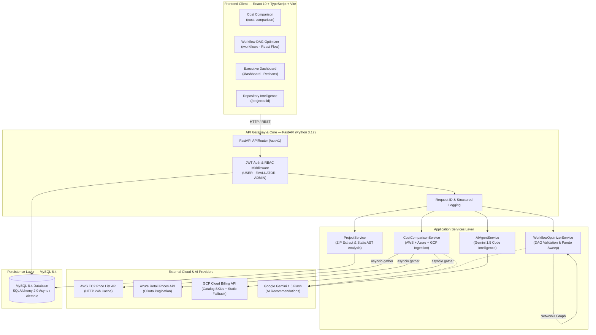

<div align="center">

# Infralytix

**AI-Powered Developer Infrastructure OS & Multi-Cloud Optimization Platform**

*An enterprise-grade platform unifying live multi-cloud cost comparison, DAG workflow makespan/cost Pareto optimization, repository intelligence, and developer infrastructure governance.*

[](https://python.org)
[](https://fastapi.tiangolo.com)
[](https://react.dev)
[](https://typescriptlang.org)
[](https://vitejs.dev)
[](https://www.mysql.com)
[](backend/tests)
[](LICENSE)

</div>

---

## 📖 Executive Overview

**Infralytix** is an intelligent developer infrastructure operating system built to solve multi-cloud fragmentation, cost opacity, and workflow inefficiencies across **Amazon Web Services (AWS)**, **Microsoft Azure**, and **Google Cloud Platform (GCP)**.

Modern engineering teams struggle with cloud pricing opacity, non-linear storage billing, complex computational dependency scheduling, and architectural blind spots. Infralytix tackles these challenges with four core pillars:

1. **Multi-Cloud Cost Comparison Engine**: Concurrently queries official AWS, Azure, and GCP price catalogs with sub-second response times, attached storage parity, and cheapest-first rankings.
2. **Multi-Cloud Workflow DAG Optimizer (FR11)**: Validates computational Directed Acyclic Graphs (DAGs) with NetworkX, simulates critical-path execution makespan and cost scaling, and sweeps cloud instance pools to construct the **Pareto-optimal frontier** (Latency vs. Cost trade-off).
3. **Repository Intelligence & AI Agent Pipeline**: Performs deep static analysis and AST code review on uploaded software repositories, orchestrating Google Gemini 1.5 Flash to generate architectural insights and code health scores.
4. **Enterprise Security & Governance**: Production-grade JWT access/refresh token rotation with reuse detection, bcrypt password hashing, and granular Role-Based Access Control (`USER`, `EVALUATOR`, `ADMINISTRATOR`).

---

## 🏛️ System Architecture


```mermaid
flowchart TB
    subgraph Client ["Frontend Client — React 19 + TypeScript + Vite"]
        UI_Cost["Cost Comparison\n(/cost-comparison)"]
        UI_DAG["Workflow DAG Optimizer\n(/workflows - React Flow)"]
        UI_Dash["Executive Dashboard\n(/dashboard - Recharts)"]
        UI_Repo["Repository Intelligence\n(/projects/:id)"]
    end

    subgraph API ["API Gateway & Core — FastAPI (Python 3.12)"]
        Router["FastAPI APIRouter (/api/v1)"]
        AuthMid["JWT Auth & RBAC Middleware\n(USER | EVALUATOR | ADMIN)"]
        ReqMid["Request ID & Structured Logging"]
    end

    subgraph Services ["Application Services Layer"]
        CostComp["CostComparisonService\n(AWS + Azure + GCP Ingestion)"]
        WorkflowOpt["WorkflowOptimizerService\n(DAG Validation & Pareto Sweep)"]
        AgentSvc["AIAgentService\n(Gemini 1.5 Code Intelligence)"]
        ProjectSvc["ProjectService\n(ZIP Extract & Static AST Analysis)"]
    end

    subgraph External ["External Cloud & AI Providers"]
        AWS_API["AWS EC2 Price List API\n(HTTP 24h Cache)"]
        Azure_API["Azure Retail Prices API\n(OData Pagination)"]
        GCP_API["GCP Cloud Billing API\n(Catalog SKUs + Static Fallback)"]
        Gemini["Google Gemini 1.5 Flash\n(AI Recommendations)"]
    end

    subgraph Storage ["Persistence Layer — MySQL 8.4"]
        DB[(MySQL 8.4 Database\nSQLAlchemy 2.0 Async / Alembic)]
    end

    Client -->|HTTP / REST| Router
    Router --> AuthMid --> ReqMid
    ReqMid --> CostComp
    ReqMid --> WorkflowOpt
    ReqMid --> AgentSvc
    ReqMid --> ProjectSvc

    CostComp -->|asyncio.gather| AWS_API
    CostComp -->|asyncio.gather| Azure_API
    CostComp -->|asyncio.gather| GCP_API
    CostComp -.-> Gemini

    WorkflowOpt -->|NetworkX Graph| WorkflowOpt
    WorkflowOpt -.-> Gemini

    AgentSvc --> Gemini
    ProjectSvc --> DB
    AuthMid --> DB
```

---

## ✨ Key Platform Features

### 1. Multi-Cloud Cost Comparison Engine
- **Live Cloud Pricing Ingestion**:
  - **AWS EC2 & EBS**: Queries AWS's official Price List API (`pricing.us-east-1.amazonaws.com`) with an in-memory 24-hour regional TTL cache. Standardized on on-demand Linux compute and `gp3` high-performance block storage ($0.08/GB-mo).
  - **Azure VMs & Disks**: Queries the Microsoft Azure Retail Prices API with OData filter expressions for Linux Consumption and Premium SSD LRS storage ($0.0576/GB-mo).
  - **Google Cloud Platform (GCP)**: Queries the GCP Cloud Billing Catalog API (`services/6F81-5844-456A/skus`) with an automated static reference catalogue fallback when `GCP_API_KEY` is not supplied. Standardized on `pd-balanced` block storage ($0.04/GB-mo).
- **Unified Regional Mapping**: Aliases human-friendly regions (`us-east`, `us-west`, `eu-west`, `us`, `eu`, `asia`) across provider-specific availability zones (`us-east-1`, `eastus`, `us-east4`, etc.).
- **Concurrent Asynchronous Fetching**: Executes provider requests in parallel via `asyncio.gather(return_exceptions=True)`, ensuring isolated failures do not block other providers.
- **Cheapest-First Parity Ranking**: Surfaces the lowest-cost cloud option with badges (`★ Lowest Cost`) and storage breakdowns.

### 2. Multi-Cloud Workflow DAG Optimizer (FR11)
- **Mathematical DAG Validation**: Ingests multi-task workflow topologies, ensuring acyclicity, task uniqueness, and dependency referential integrity using **NetworkX**.
- **Critical-Path Makespan Calculation**: Rather than a naive sum of durations, computes true critical-path execution time taking into account task dependencies, concurrency ceilings, and execution pipelines.
- **Category-Aware Scaling**: Evaluates instance speedups across task profiles:
  - `compute-bound`: Scales non-linearly with CPU frequency and core count.
  - `memory-bound`: Scales with RAM bandwidth and allocation thresholds.
  - `io-bound`: Scales with attached disk IOPS and storage throughput.
- **Pareto-Optimal Multi-Cloud Sweep**: Evaluates candidate VM instances across AWS, Azure, and GCP simultaneously, automatically discarding dominated configurations and returning the **Pareto frontier** of Cost vs. Latency.
- **Knee-Point Labeling**: Automatically classifies solutions into `Cheapest`, `Fastest`, and `Best-Balance` (minimum normalized Euclidean distance to ideal point).
- **Interactive Visual Canvas**: Renders the DAG via **React Flow** and the Pareto trade-off curve with an interactive **Recharts** scatter plot.

### 3. Repository Intelligence & AI Agent Pipeline
- **ZIP Code Ingestion**: Upload complete repository archives via `POST /api/v1/projects/{id}/upload`.
- **Static AST Analysis**: Extracts total lines of code (LOC), language breakdown, file trees, cyclomatic complexity, and documentation coverage.
- **Structured Gemini Code Review**: Orchestrates **Google Gemini 1.5 Flash** with JSON-mode output to evaluate code health, architecture anti-patterns, security risks, and optimization recommendations (with deterministic heuristic fallback when no key is set).

### 4. Enterprise Security & Access Control (RBAC)
- **JWT Authentication**: Short-lived Access Tokens (30m) paired with rotating Refresh Tokens (7d).
- **Token Reuse Detection**: Immediate revocation of entire refresh chains if token replay or theft is detected.
- **Role-Based Access Control (RBAC)**: Enforces access levels:
  - `USER`: Workspace member; read/write access to own projects and public tools.
  - `EVALUATOR`: Analytical role; runs optimization sweeps and cost evaluations.
  - `ADMINISTRATOR`: Full administrative control over user accounts and platform settings.
- **Secure Password Hashing**: Passlib + bcrypt with timing attack mitigation.

---

## 🛠️ Technology Stack

| Layer | Technologies | Rationale |
| :--- | :--- | :--- |
| **Backend Framework** | **Python 3.12**, **FastAPI 0.115**, **Uvicorn** | Native async concurrency for live API ingestion; strict typing with Pydantic v2. |
| **Database & ORM** | **MySQL 8.4**, **SQLAlchemy 2.0 (Async)**, **Alembic** | Enterprise relational storage; async `aiomysql` driver with connection pooling. |
| **Graph / Optimization** | **NetworkX 3.4** | Rigorous DAG topology validation, topological sorting, and cycle detection. |
| **AI Orchestration** | **Google Gemini 1.5 Flash** | Low-latency, cost-effective architectural reasoning with deterministic fallbacks. |
| **Frontend Core** | **React 19**, **TypeScript 5.7**, **Vite 6** | Ultra-fast HMR, strict type-checking, modern component architecture. |
| **Styling & UI** | **TailwindCSS 3.4**, **Glassmorphism Design System** | Modern dark-mode interface with custom glass cards, gradients, and micro-interactions. |
| **Data Visualization** | **React Flow 11**, **Recharts 3** | Interactive node-based DAG diagrams and Pareto scatter trade-off charts. |
| **Code Quality & Testing**| **Pytest 8.3**, **Ruff 0.8**, **Mypy 1.13**, **ESLint 9** | 267 automated backend tests; zero-warning TypeScript and lint checks. |
| **DevOps & Containers** | **Docker**, **Docker Compose** | Multi-stage Dockerfiles for lean development and production deployment. |

---

## 📂 Repository Structure

```
INFRALYTIX/
├── .env.example                 # Root environment template
├── docker-compose.yml           # Production Docker Compose orchestration
├── docker-compose.dev.yml       # Local development Docker Compose
├── docs/                        # Architectural documentation, PRDs, and ADRs
│   ├── adr/                     # Architecture Decision Records (ADR-001, ADR-002)
│   └── requirements/            # Functional specifications (FR11 Workflow Optimizer)
│
├── backend/                     # FastAPI Backend Application
│   ├── pyproject.toml           # PEP 621 Python dependencies & build config
│   ├── alembic.ini              # Database migration configuration
│   ├── alembic/                 # Version-controlled database migrations
│   ├── app/
│   │   ├── api/v1/              # Versioned API routes (auth, projects, cost, workflows)
│   │   ├── config/              # Pydantic Settings v2 environment configuration
│   │   ├── database/            # SQLAlchemy async engine & session management
│   │   ├── exceptions/          # Centralized error hierarchy & HTTP handlers
│   │   ├── logging/             # Structured JSON & contextual logging
│   │   ├── middlewares/         # Request ID tracing, CORS, and Auth guards
│   │   ├── models/              # SQLAlchemy ORM declarative entities
│   │   ├── repositories/        # Repository pattern for database abstraction
│   │   ├── schemas/             # Pydantic DTO validation schemas
│   │   ├── services/            # Core business logic (pricing, DAG optimizer, AI agents)
│   │   │   └── pricing/         # AWS, Azure, and GCP price list clients
│   │   └── utils/               # Security, crypto, and DAG helper utilities
│   └── tests/                   # 267 comprehensive Pytest automated tests
│
└── frontend/                    # React 19 Single Page Application
    ├── package.json             # NPM dependencies and scripts
    ├── vite.config.ts           # Vite bundler, path aliases, and API proxy
    ├── tailwind.config.ts       # Glassmorphism tokens, color palettes, and utilities
    └── src/
        ├── components/          # Reusable UI library (AppShell, ProtectedRoute, Buttons)
        ├── features/            # Domain modules
        │   ├── auth/            # Login, registration, token refresh, and AuthContext
        │   ├── cost-comparison/ # Multi-cloud comparison form & cheapest-first cards
        │   ├── workflows/       # DAG visualizer, Pareto scatter chart, AI summary
        │   ├── projects/        # Repository ZIP upload, file tree, code health
        │   └── dashboard/       # Overview metrics, recent agent runs, cost breakdown
        └── lib/                 # Axios API client with automatic token attachment
```

---

## ⚙️ Environment Configuration

Create a `.env` file in `/backend` (or copy from `backend/.env.example`):

```bash
# Application
APP_NAME=Infralytix
APP_ENV=development              # development | staging | production
DEBUG=true

# Server
HOST=0.0.0.0
PORT=8000

# Database — MySQL 8.4
DB_HOST=localhost                # Use 'mysql' inside Docker
DB_PORT=3306
DB_USER=infralytix_user
DB_PASSWORD=infralytix_password
DB_NAME=infralytix_db
MYSQL_ROOT_PASSWORD=root_password

# Security — JWT (Generate with: python -c "import secrets; print(secrets.token_hex(64))")
SECRET_KEY=947d922a94519969c57d76bb925d488f72a6b29f798f090bb70972e399ecfdb8
ALGORITHM=HS256
ACCESS_TOKEN_EXPIRE_MINUTES=30
REFRESH_TOKEN_EXPIRE_DAYS=7

# CORS
ALLOWED_ORIGINS=["http://localhost:5173","http://localhost:3000"]

# AI & Cloud Pricing APIs
GEMINI_API_KEY=your_gemini_key_here          # Optional: Enables live Gemini AI suggestions
GCP_API_KEY=your_gcp_billing_key_here        # Optional: Enables live GCP Cloud Billing Catalog
# Note: AWS EC2 and Azure Pricing APIs are public and require no keys.
```

---

## 🚀 Quickstart & Local Setup

### Prerequisites
- **Python 3.12+**
- **Node.js 20+** and **npm 10+**
- **MySQL 8.4** (or Docker)

### Option A: Local Native Development

#### 1. Backend Setup
```bash
cd backend

# 1. Create and activate Python 3.12 virtual environment
python -m venv .venv

# On Windows:
.venv\Scripts\activate
# On Linux/macOS:
source .venv/bin/activate

# 2. Install dependencies (including dev & test tools)
pip install -e ".[dev]"

# 3. Configure environment
copy .env.example .env  # on Windows (or cp on Unix)
# Fill in SECRET_KEY and DB credentials in .env

# 4. Start the FastAPI development server
uvicorn app.main:app --host 0.0.0.0 --port 8000 --reload
```
The backend is now live at `http://localhost:8000` (Interactive OpenAPI Swagger docs: `http://localhost:8000/docs`).

#### 2. Frontend Setup
```bash
cd frontend

# 1. Install dependencies
npm install

# 2. Start the Vite development server
npm run dev
```
Open `http://localhost:5173` in your browser. (The Vite proxy automatically forwards `/api` requests to `http://localhost:8000`).

---

### Option B: Full Docker Deployment

To launch the complete containerized stack (MySQL 8.4 + FastAPI Backend + React/Nginx Frontend):

```bash
# Start all containers in background
docker compose up -d

# Check running services
docker compose ps

# View backend logs
docker compose logs -f backend
```

---

## 📡 Core API Reference

| Method | Endpoint | Access | Description |
| :--- | :--- | :--- | :--- |
| `POST` | `/api/v1/cost-comparison` | **Public** | Concurrently evaluates AWS, Azure, and GCP pricing for a given vCPU/RAM/storage profile. |
| `POST` | `/api/v1/workflows` | **Public** | Ingests a workflow task DAG, validates acyclicity, and returns structural metrics. |
| `POST` | `/api/v1/workflows/optimize` | **Public** | Runs a multi-cloud Pareto instance sweep across cost and makespan with AI trade-off analysis. |
| `POST` | `/api/v1/auth/register` | **Public** | Registers a new user account with hashed password. |
| `POST` | `/api/v1/auth/login` | **Public** | Authenticates user; returns Access Token and sets HTTP-only Refresh Token cookie. |
| `POST` | `/api/v1/auth/refresh` | **Public** | Rotates refresh token and returns a new Access Token. |
| `GET` | `/api/v1/projects` | `USER` | Lists all projects belonging to the authenticated user. |
| `POST` | `/api/v1/projects/{id}/upload` | `USER` | Uploads and extracts a ZIP archive of a software repository for AST analysis. |
| `POST` | `/api/v1/projects/{id}/analyze` | `USER` | Invokes Gemini 1.5 Flash agent to generate code health and architecture insights. |
| `GET` | `/api/v1/health` | **Public** | Service liveness and readiness probe. |

---

## 🧪 Testing & Quality Assurance

Infralytix maintains strict test coverage and static validation standards:

```bash
# Run all backend unit, integration, and pricing cache tests
cd backend
pytest -v

# Run type checker
mypy app

# Run code style & linting
ruff check .

# Frontend TypeScript validation & bundle audit
cd ../frontend
npm run type-check
npm run build
npm run lint
```

**Test Suite Status**:
- **267 passed** across all backend test modules:
  - `test_cost_comparison_service.py` (Concurrency, fallbacks, pricing formulas)
  - `test_workflows.py` (DAG acyclicity, cycle rejection, validation)
  - `test_workflow_optimizer.py` (Pareto front correctness, knee-point selection)
  - `test_auth.py` & `test_user_repository.py` (JWT lifecycle, refresh token reuse detection)
  - `test_project_repository.py` & `test_agent_run_repository.py` (Repository persistence)
  - `test_health.py` (Liveness & readiness probes)

---

## 📜 Architectural Decisions (ADRs)

Key architectural selections are formally documented under [docs/adr/](docs/adr/):
- **[ADR-001: Technology Stack Selection](docs/adr/ADR-001-tech-stack.md)**: Details why Python 3.12 + FastAPI and React 19 were selected over legacy frameworks for AI infrastructure tooling.
- **[ADR-002: Database and RBAC Specification](docs/adr/ADR-002-database-and-rbac-correction.md)**: Formally documents the production migration to MySQL 8.4 and the `USER`, `EVALUATOR`, `ADMINISTRATOR` RBAC model.

---

## 📄 License

This project is open source and licensed under the [MIT License](LICENSE).
